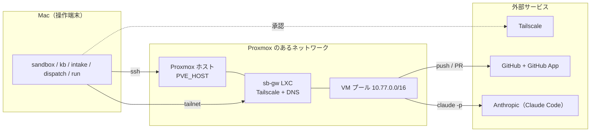

# 前提と準備するもの

このページで分かること: 工場を動かすために必要な機材・アカウント・ソフトウェアと、それぞれが何のために要るか。

## 全体像

## 機材

| もの | 要件 | 何のため |
|---|---|---|
| Proxmox VE ホスト | 9.x、LVM-thin のローカルストレージ。RAM は「VM 1 台 8 GB × 台数 + 余裕」（PJ 3 つ × 3 台 + 汎用 3 台なら 100 GB 程度） | VM プールを置く。ホスト名は `~/.config/sandbox/env` の `PVE_HOST`（ssh エイリアス）で指す |
| Mac | macOS、ssh、`python3` 3.10 以上、`jq`、`gh`、`curl`、`openssl` | すべての CLI はここで動く。runner は Python、`sandbox` は bash |
| ネットワーク | Proxmox 上に SDN（simple zone）を切れること。外向き SNAT | VM に専用 IP 空間 `10.77.0.0/16`（`SB_NET` で変更可）を与える |

!!! warning "Proxmox ホストの電源"
    ホストが落ちると VM プールごと止まります。遠隔で起こせる手段（Wake-on-LAN、IPMI など）を先に確かめておいてください。プール VM は `onboot=0` なので、復旧後は手で `qm start` します。

## アカウントとサービス

| サービス | 用意するもの | 何のため |
|---|---|---|
| Tailscale | tailnet 1 つ。管理コンソールで subnet route を承認できる権限。ACL を編集する場合は API キー | Mac から VM に届く経路。ゲートウェイ LXC だけを tailnet に入れ、`10.77.0.0/16` を広告する |
| GitHub | 対象リポジトリへの管理権限（GitHub App を install できること） | VM から push / PR / マージするための 1 時間トークンを GitHub App が払い出す |
| Anthropic | Claude Code が使えるプラン。PJ ごとに `claude setup-token` で長期トークンを発行 | VM の中で `claude -p` を動かす認証 |

## ソフトウェア（Mac 側）

| ツール | 版 | 確認コマンド |
|---|---|---|
| Python | 3.10 以上（標準ライブラリ + `pyyaml` + `jsonschema`） | `python3 -c "import yaml, jsonschema"` |
| Claude Code | 最新 | `claude --version` |
| GitHub CLI | 2.x | `gh --version` |
| jq | 1.6 以上 | `jq --version` |
| ssh / scp | OpenSSH | `ssh -V` |

Proxmox 側と VM 側に入れるものは構築スクリプトが入れます（[sandbox の構築](build-sandbox.md)）。

## 対象 PJ

工場に入れるリポジトリ（PJ）は、`$AIFACTORY_WORKSPACE/projects/<pj>/` に 3 ファイル（`provision.sh` / `project.yml` / `gates.sh`）を置いて定義します。同梱の例が 1 つあります。

| PJ | リポジトリ | スタック | 置き場 |
|---|---|---|---|
| kumitate | [akkijp/kumitate](https://github.com/akkijp/kumitate) | pnpm 10 monorepo + Next.js + PostgreSQL 16（pgvector）+ drizzle + vitest | `examples/projects/kumitate/` |

PJ を足す手順は [PJ を追加する](../guides/add-project.md)。

## 別の環境で動かすには

置き換えるのは次の 4 点です。

1. **Proxmox ホスト**: `~/.config/sandbox/env` の `PVE_HOST`（ssh のエイリアス、必須）と `GW_SSH`（ゲートウェイ LXC への ssh 先、必須）。Proxmox 側スクリプトのノード名は `SB_NODE`（既定はホスト自身の hostname）
2. **IP 空間と VMID**: 既定は `SB_NET=10.77`（/16 のプレフィックス）、`SB_GW_CT=9000`、`SB_BASE_VMID=9100`、`SB_POOL_BASE=9200`。Mac 側は `SB_POOL_NET=10.77.1`。変えるなら Proxmox 側と Mac 側の両方をそろえる（`sandbox/README.md` の「命名・採番・アドレス」）
3. **GitHub App**: `sandbox/bin/gh-app-setup` で自分のアカウントに作る
4. **PJ 定義**: `$AIFACTORY_WORKSPACE/projects/<pj>/`（provision.sh / project.yml / gates.sh）

この 4 点以外（kanban / glue / workflow）は環境に依存しません。
