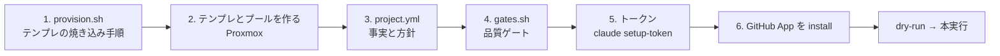

# PJ を追加する

このページで分かること: 新しいリポジトリを工場に入れるための 6 つの作業と、それぞれのファイルの書き方。所要はテンプレートの焼き込み（依存の重さ次第で 10〜40 分）を含めて 1〜2 時間です。手本は同梱の `examples/projects/kumitate/`（[akkijp/kumitate](https://github.com/akkijp/kumitate)、pnpm monorepo + Next.js + PostgreSQL）です。

## 作業の全体



PJ 固有のものは PJ 定義ディレクトリの 3 ファイルにしか無い、というのがこの工場の約束です（ADR-0009）。workflow は複製しません。

| 置き場 | 役割 |
|---|---|
| `$AIFACTORY_WORKSPACE/projects/<pj>/` | 自分の PJ 定義。git 追跡外（workspace） |
| `examples/projects/<pj>/` | リポジトリ同梱の例。`kb` / `intake` / `dispatch` / runner / コンソールは workspace に無い PJ をここから探す |

## 0. 例を写す

```bash
mkdir -p "${AIFACTORY_WORKSPACE:-workspace}/projects"
cp -r examples/projects/kumitate "${AIFACTORY_WORKSPACE:-workspace}/projects/myapp"
ls "${AIFACTORY_WORKSPACE:-workspace}/projects/myapp"      # provision.sh  project.yml  gates.sh
```

以下、`myapp` を新しい PJ の slug として進めます（`sandbox take myapp …`、`kb new myapp …` に使う名前です）。

## 1. provision.sh を書く

`provision.sh` は、base テンプレートから clone した VM の中で `dev` ユーザーとして実行され、リポジトリの clone、ランタイム、依存、DB、アプリ常駐を焼き込みます。雛形は `sandbox/templates/README.md`、実例は `examples/projects/kumitate/provision.sh` です。

```bash
#!/usr/bin/env bash
set -euo pipefail
export PATH="$HOME/.local/bin:$HOME/.local/share/mise/shims:$PATH"
: "${GH_TOKEN:?GH_TOKEN が必要（焼き込み時のみ。テンプレートには残さない）}"
REPO="owner/myapp"
APP="$HOME/app"

gh auth setup-git                      # take 時に注入される GH_TOKEN で push できるように
gh repo clone "$REPO" "$APP" -- --branch develop
cd "$APP"
mise install && mise reshim            # .node-version / .ruby-version に従う
corepack enable --install-directory ~/.local/bin && corepack prepare pnpm@10 --activate
pnpm install --frozen-lockfile         # 依存
pnpm --filter @myapp/db db:migrate     # DB（PostgreSQL は base で role dev / trust 済み）
# アプリを systemd で常駐（clean スナップショットは起動済み状態で取る）
sudo tee /etc/systemd/system/sandbox-app.service >/dev/null <<EOF
…
EOF
sudo systemctl daemon-reload && sudo systemctl enable --now sandbox-app
# 焼く前の後片付け
unset GH_TOKEN; gh auth logout --hostname github.com || true; rm -f ~/.config/gh/hosts.yml ~/.bash_history
```

ポイント:

- clone に使うトークンは環境変数で渡し、テンプレートには残さない（`GH_TOKEN="$(gh auth token)"`）
- base に無いもの（MySQL、pgvector、ブラウザの依存など）は provision で入れる。kumitate の例は `postgresql-16-pgvector` を apt で足している
- リポジトリ直下がアプリでないなら `SANDBOX_APP_DIR` を `/etc/sandbox/app.env` に書く（kumitate は `apps/kumitate/`）
- seed が壊れているならこの段階で分かる。直すのは PJ 側（チケットにする）

## 2. テンプレートとプールを作る

```bash
GH_TOKEN="$(gh auth token)" TPL_VMID=9111 PJ=myapp sandbox/proxmox/run.sh 32-pj-template.sh
TPL_VMID=9111 sandbox/proxmox/run.sh 40-pool.sh myapp 3
sandbox/proxmox/run.sh 50-firewall.sh       # 通信制限とスナップショットの取り直し
sandbox ls                                  # sb-myapp-01〜03 が見える
```

`32-pj-template.sh` は `PJ` の `provision.sh` を workspace → `examples/` の順に探します。VMID とアドレスの規則は `sandbox/README.md` の「命名・採番・アドレス」。PJ テンプレートは 911x、プールは 92xx で IP は `10.77.1.(VMID−9200)` です（`SB_POOL_BASE` / `SB_POOL_NET` で変更可）。

## 3. project.yml を書く

`project.yml` は、runner が依頼文に貼る「PJ の事実と方針」です。形は `workflow/kit/schema/project.schema.json` で検証されます。kumitate の実物（`examples/projects/kumitate/project.yml`）を短くしたものです。

```yaml
name: myapp
display_name: myapp
repo: owner/myapp
base_branch: develop          # 通常の作業ブランチの元と PR の宛先
hotfix_base: main             # hotfix の宛先（省略時は base_branch）
app_dir: /home/dev/app        # VM 内のアプリのディレクトリ（cwd になる）
url: http://localhost:3000    # VM 内から見たアプリの URL
gates: gates.sh               # 同じディレクトリのゲートスクリプト
stack: "pnpm 10 monorepo / Node 22 / Next.js / PostgreSQL 16 / vitest"
facts:                        # agent に毎回伝える事実。1 項目 1 行
  - "依存は `pnpm install --frozen-lockfile`。pnpm は packageManager の版に固定"
  - "個別テストは `pnpm --filter @myapp/web exec vitest run <file>`"
  - "既知の問題（2026-09-06）: calendar の表題テスト 2 件がフィクスチャ固定で時間依存"
review_points:                # reviewer が必ず見る観点
  - "packages/db の schema 変更に migration が伴っているか"
forbidden:                    # この PJ でやってはいけないこと
  - ".github/workflows を変えない"
  - ".env の実値をコミットしない"
known_red_gates: []           # base で既に赤いゲート名。直す PR がマージされたら消す
```

| 項目 | 必須 | 書くこと |
|---|---|---|
| `name` / `repo` / `base_branch` / `app_dir` / `gates` | 必須 | 場所と宛先 |
| `stack` | 推奨 | 1 行。依頼文の冒頭に出る |
| `facts` | 推奨 | テストの走らせ方、生成物の置き場、既知の問題。**「全 PJ で同じ注意」は書かない**（それは `roles/_common.md`） |
| `review_points` / `forbidden` | 推奨 | PJ 固有の観点と禁止 |
| `known_red_gates` | 必要なら | 書くと runner が FAIL を INFO に格下げし、agent に「直せ」と戻さない |
| `workflow_overrides` | 稀 | workflow 名 → `base_branch` の上書き |

## 4. gates.sh を書く {#gates-sh}

`gates.sh` は VM 内で `$SANDBOX_APP_DIR` を cwd に実行され、ゲートごとに `PASS <name>` / `FAIL <name> (<log>)` を 1 行ずつ出し、全緑なら 0 で終わります。**PJ の CI と同じ組**にします。kumitate の実物はこの形です。

```bash
#!/usr/bin/env bash
set -uo pipefail
export PATH="$HOME/.local/bin:$HOME/.local/share/mise/shims:$PATH"
cd "${SANDBOX_APP_DIR:-$HOME/app}"
mkdir -p "$HOME/gates"; rc=0
gate() { local name=$1; shift; if "$@" > "$HOME/gates/$name.log" 2>&1; then echo "PASS $name"; else echo "FAIL $name (~/gates/$name.log)"; rc=1; fi; }
gate typecheck pnpm --filter @myapp/web typecheck
gate lint      pnpm --filter @myapp/web lint
gate test      pnpm --filter @myapp/web test
exit $rc
```

情報扱いにしたいもの（赤でも止めない）は `gate` ではなく `INFO` を出す形にするか、`known_red_gates` に書きます。実行時間はここが大半なので、まず「CI と同じ」で始め、重ければ後で差分実行を考えます。Rails なら `gate rubocop bundle exec rubocop` / `gate rspec bundle exec rspec` のように並べます。

## 5. トークンを保存する 🧑

```bash
claude setup-token
sandbox token set myapp                  # Claude トークン
echo 'GH_REPO=owner/myapp' >> ~/.config/sandbox/pj/myapp.env
sandbox token show myapp
```

## 6. GitHub App を install する 🧑

`sandbox gh-app status` に出る install リンクから、リポジトリのオーナーに App を install します（オーナーの管理権限が要ります）。`status` で `myapp: owner/myapp OK` になれば、`take` のたびに 1 時間トークンが払い出されます。

## 7. 確かめる

```bash
sandbox take myapp 001 && sandbox ssh 001 'cd $SANDBOX_APP_DIR && git status && claude --version' && sandbox release 001
kanban/bin/kb new myapp chore "docs: 動作確認" --body - <<< "README の typo を 1 箇所直す。## 完了条件
- gates 緑"
kanban/bin/kb run <id> --dry-run       # schema 検証と依頼文
kanban/bin/kb run <id>                 # 本実行
```

dry-run の `prompt-implement-0.md` を読んで、facts に足りないもの（テストの走らせ方など）が無いかを見てから本実行してください。

## チェックリスト

| 項目 | 確認 |
|---|---|
| provision.sh | `32-pj-template.sh` が最後まで通り、テンプレートにトークンが残っていない |
| テンプレ / プール | `sandbox ls` に `sb-myapp-01〜03` が見える |
| project.yml | `kb run --dry-run` の schema 検証が通る |
| gates.sh | `sandbox ssh <id> 'bash ~/work/gates.sh'` 相当が CI と同じ結果を出す |
| トークン | `sandbox token show myapp` |
| App | `sandbox gh-app status` で `OK` |

`project.yml` が無い PJ は起票はできますが、dispatch が `blocked` にします。
