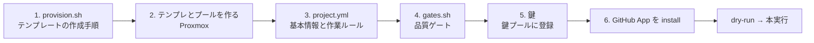

# プロジェクトを追加する

新しいリポジトリを aifactory の作業対象として登録する手順を説明します。必要なのは、環境構築スクリプト、VM のテンプレートとプール、プロジェクト設定、検証スクリプト、Claude Code のトークン、GitHub App の設定です。所要時間の目安は 1〜2 時間で、このうちテンプレートの作成に 10〜40 分かかります。

同梱の例は 2 つあります。`examples/projects/aifactory/` は、この公開リポジトリ自身を対象にした例です。VM を用意して一連の処理を試せます。アプリとしてポート 3000 で `mkdocs serve` を起動します。`examples/projects/kumitate/` は、[akkijp/kumitate](https://github.com/akkijp/kumitate) を対象とし、pnpm monorepo、Next.js、PostgreSQL を使う大きめのアプリの設定例です。

## 作業の流れ



プロジェクト固有の設定は、定義ディレクトリ内の 3 ファイル（`provision.sh`、`project.yml`、`gates.sh`）にまとめます。ワークフローは全プロジェクトで共通のものを使います（ADR-0009）。

| 置き場 | 役割 |
|---|---|
| `$AIFACTORY_WORKSPACE/projects/<pj>/` | 自分のプロジェクト定義。git 追跡外（workspace） |
| `examples/projects/<pj>/` | リポジトリ同梱の例。`kb` / `intake` / `dispatch` / runner / コンソールは workspace にないプロジェクトをここから探す |

## 0. 例を写す

```bash
mkdir -p "${AIFACTORY_WORKSPACE:-workspace}/projects"
cp -r examples/projects/kumitate "${AIFACTORY_WORKSPACE:-workspace}/projects/myapp"
ls "${AIFACTORY_WORKSPACE:-workspace}/projects/myapp"      # provision.sh  project.yml  gates.sh
```

以下、`myapp` を新しいプロジェクトの slug として進めます（`sandbox take myapp …`、`kb new myapp …` に使う名前です）。

## 1. provision.sh を書く

`provision.sh` は、base テンプレートから clone した VM の中で `dev` ユーザーとして実行され、リポジトリを取得し、ランタイム、依存パッケージ、DB、アプリの常駐設定を用意します。ひな形は `sandbox/templates/README.md`、実例は `examples/projects/kumitate/provision.sh` です。

```bash
#!/usr/bin/env bash
set -euo pipefail
export PATH="$HOME/.local/bin:$HOME/.local/share/mise/shims:$PATH"
: "${GH_TOKEN:?GH_TOKEN が必要（焼き込み時のみ。テンプレートには残さない）}"
REPO="owner/myapp"
APP="$HOME/app"

gh auth setup-git                      # take 時に注入される GH_TOKEN で push できるように
gh repo clone "$REPO" "$APP" -- --branch develop
cd "$APP"
mise install && mise reshim            # .node-version / .ruby-version に従う
corepack enable --install-directory ~/.local/bin && corepack prepare pnpm@10 --activate
pnpm install --frozen-lockfile         # 依存
pnpm --filter @myapp/db db:migrate     # DB（PostgreSQL は base で role dev / trust 済み）
# アプリを systemd で常駐（clean スナップショットは起動済み状態で取る）
sudo tee /etc/systemd/system/sandbox-app.service >/dev/null <<EOF
…
EOF
sudo systemctl daemon-reload && sudo systemctl enable --now sandbox-app
# 焼く前の後片付け
unset GH_TOKEN; gh auth logout --hostname github.com || true; rm -f ~/.config/gh/hosts.yml ~/.bash_history
```

ポイント:

- clone に使うトークンは環境変数で渡し、テンプレートには残さない（`GH_TOKEN="$(gh auth token)"`）
- base にないもの（MySQL、pgvector、ブラウザの依存など）は provision で入れる。kumitate の例は `postgresql-16-pgvector` を apt で足している
- リポジトリ直下がアプリでないなら `SANDBOX_APP_DIR` を `/etc/sandbox/app.env` に書く（kumitate は `apps/kumitate/`）
- seed が壊れているならこの段階で分かる。直すのはプロジェクト側（チケットにする）

## 2. テンプレートとプールを作る

```bash
GH_TOKEN="$(gh auth token)" TPL_VMID=9111 PJ=myapp sandbox/proxmox/run.sh 32-pj-template.sh
TPL_VMID=9111 sandbox/proxmox/run.sh 40-pool.sh myapp 3
sandbox/proxmox/run.sh 50-firewall.sh       # 通信制限とスナップショットの取り直し
sandbox ls                                  # sb-myapp-01〜03 が見える
```

`32-pj-template.sh` は `PJ` の `provision.sh` を workspace → `examples/` の順に探します。VMID とアドレスの規則は `sandbox/README.md` の「命名・採番・アドレス」。プロジェクトテンプレートは 911x、プールは 92xx で IP は `10.77.1.(VMID−9200)` です（`SB_POOL_BASE` / `SB_POOL_NET` で変更可）。

## 3. project.yml を書く

`project.yml` には、runner がエージェントに伝えるプロジェクトの基本情報や作業ルールを記述します。形式は `workflow/kit/schema/project.schema.json` で検証されます。以下は、kumitate の設定（`examples/projects/kumitate/project.yml`）をもとにした短い例です。

```yaml
name: myapp
display_name: myapp
repo: owner/myapp
base_branch: develop          # 通常の作業ブランチの元と PR の宛先
hotfix_base: main             # hotfix の宛先（省略時は base_branch）
app_dir: /home/dev/app        # VM 内のアプリのディレクトリ（cwd になる）
url: http://localhost:3000    # VM 内から見たアプリの URL
gates: gates.sh               # 同じディレクトリのゲートスクリプト
prepare: prepare.sh           # 任意。貸出直後に環境を base へ揃える（依存の再取得・マイグレーション）
stack: "pnpm 10 monorepo / Node 22 / Next.js / PostgreSQL 16 / vitest"
facts:                        # agent に毎回伝える事実。1 項目 1 行
  - "依存は `pnpm install --frozen-lockfile`。pnpm は packageManager の版に固定"
  - "個別テストは `pnpm --filter @myapp/web exec vitest run <file>`"
  - "既知の問題（2026-09-06）: calendar の表題テスト 2 件がフィクスチャ固定で時間依存"
review_points:                # reviewer が必ず見る観点
  - "packages/db の schema 変更に migration が伴っているか"
forbidden:                    # この PJ でやってはいけないこと
  - ".github/workflows を変えない"
  - ".env の実値をコミットしない"
known_red_gates: []           # base で既に赤いゲート名。直す PR がマージされたら消す
```

| 項目 | 必須 | 書くこと |
|---|---|---|
| `name` / `repo` / `base_branch` / `app_dir` / `gates` | 必須 | 場所と宛先 |
| `stack` | 推奨 | 1 行。依頼文の冒頭に出る |
| `facts` | 推奨 | テストの実行方法、生成物の置き場、既知の問題。**「全プロジェクトで同じ注意」は書かない**（それは `roles/_common.md`） |
| `review_points` / `forbidden` | 推奨 | プロジェクト固有の観点と禁止 |
| `prepare` | 必要なら | 貸出直後に走らせる準備スクリプト。VM のテンプレートと base の差（依存・マイグレーション）を埋める |
| `known_red_gates` | 必要なら | 書くと runner が FAIL を INFO（参考情報）として扱うように変更し、エージェントに「直せ」と戻さない |
| `workflow_overrides` | 稀 | ワークフロー名 → `base_branch` の上書き |

## 4. gates.sh を書く {#gates-sh}

`gates.sh` は、VM 内で `$SANDBOX_APP_DIR` を作業ディレクトリとして実行します。ゲートごとに `PASS <name>` または `FAIL <name> (<log>)` を 1 行ずつ出力し、すべて成功した場合は終了コード 0 を返します。**検証項目は、プロジェクトの CI とそろえてください。** 以下は kumitate と同じ形式で書いた例です。

```bash
#!/usr/bin/env bash
set -uo pipefail
export PATH="$HOME/.local/bin:$HOME/.local/share/mise/shims:$PATH"
cd "${SANDBOX_APP_DIR:-$HOME/app}"
mkdir -p "$HOME/gates"; rc=0
SELECT="$*"   # 引数があればその名前のゲートだけ走らせる（runner が base で確かめるときに使う）
gate() { local name=$1; shift
  if [ -n "$SELECT" ]; then case " $SELECT " in *" $name "*) ;; *) return 0 ;; esac; fi
  if "$@" > "$HOME/gates/$name.log" 2>&1; then echo "PASS $name"; else echo "FAIL $name (~/gates/$name.log)"; rc=1; fi
}
gate typecheck pnpm --filter @myapp/web typecheck
gate lint      pnpm --filter @myapp/web lint
gate test      pnpm --filter @myapp/web test
exit $rc
```

情報扱いにしたいもの（失敗しても止めない）は `gate` ではなく `INFO` を出す形にするか、`known_red_gates` に書きます。実行時間はここが大半なので、まず「CI と同じ」で始め、重ければ後で差分実行を考えます。Rails なら `gate rubocop bundle exec rubocop` / `gate rspec bundle exec rspec` のように並べます。

ゲートが赤いとき、runner は**その赤いゲートだけ**を base でも実行し、base でも赤ければ実装工程に戻しません。上の `SELECT` はそのための契約です（引数なしなら今までどおり全部走ります）。

**依存の再取得やマイグレーションはゲートに入れないでください。** それは「品質を測る」前の準備で、失敗したときの宛先も違います（ゲートの赤は実装エージェント、準備の失敗は人）。準備は `prepare.sh` に書き、`project.yml` の `prepare` で指定します。

```bash
#!/usr/bin/env bash
set -euo pipefail
cd "${SANDBOX_APP_DIR:-$HOME/app}"
pnpm install --frozen-lockfile
pnpm --filter @myapp/db db:migrate
```

VM は run が終わるたびにテンプレートへ戻り、base だけが進みます。`prepare` はその差を埋めます。失敗した場合、runner はエージェントを起動せずに終了します（`failure: prepare`）。

## 5. 鍵と GH_REPO を用意する 🧑

Claude の鍵は PJ ごとではなく、制御系の鍵プールで持ちます。すでにプールに鍵があれば、この PJ にも自動で使われるので新しく登録する必要はありません（`sandbox keys list` か console の「鍵」画面で確認）。

```bash
claude setup-token                                          # 鍵がまだ無いときだけ
sandbox keys add <名前> --fable --other --note "誰の契約か"  # 鍵プールに登録（console の「鍵」画面でも可）
echo 'GH_REPO=owner/myapp' >> ~/.config/sandbox/pj/myapp.env
sandbox keys list                                           # 用途の合う有効な鍵があること
```

VM に渡る Claude の鍵はこのプールからだけ選ばれます。`pj/myapp.env` に `CLAUDE_CODE_OAUTH_TOKEN` を書いても使われません（ADR-0060）。

## 6. GitHub App をインストールする 🧑

`sandbox gh-app status` に出るインストールリンクから、リポジトリのオーナーに App をインストールします（オーナーの管理権限が要ります）。`status` で `myapp: owner/myapp OK` になれば、`take` のたびに 1 時間トークンが払い出されます。

## 7. 確かめる

```bash
sandbox take myapp 001 && sandbox ssh 001 'cd $SANDBOX_APP_DIR && git status && claude --version' && sandbox release 001
kanban/bin/kb new myapp chore "docs: 動作確認" --body - <<< "README の typo を 1 箇所直す。## 完了条件
- gates 緑"
kanban/bin/kb run <id> --dry-run       # schema 検証と依頼文
kanban/bin/kb run <id>                 # 本実行
```

dry-run の `prompt-implement-0.md` を読んで、facts に足りないもの（テストの実行方法など）がないかを見てから本実行してください。

## チェックリスト

| 項目 | 確認 |
|---|---|
| provision.sh | `32-pj-template.sh` が最後まで通り、テンプレートにトークンが残っていない |
| テンプレ / プール | `sandbox ls` に `sb-myapp-01〜03` が見える |
| project.yml | `kb run --dry-run` のスキーマ検証が通る |
| gates.sh | `sandbox ssh <id> 'bash ~/work/gates.sh'` 相当が CI と同じ結果を出す |
| 鍵 | `sandbox keys list` に用途の合う有効な鍵がある |
| App | `sandbox gh-app status` で `OK` |

`project.yml` がないプロジェクトはチケットの作成はできますが、dispatch が `blocked` にします。
