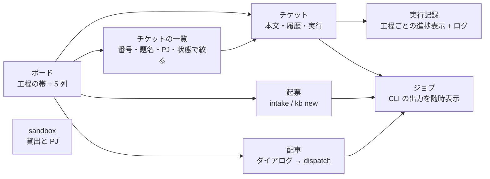

# Web コンソール

Web コンソールでは、チケットの状態、実行中のログ、VM の使用状況をブラウザで確認できます。チケットの作成や実行も画面から操作できるため、CLI のコマンドを覚えなくても日常の作業を進められます。

## 起動

```bash
console/bin/console --open        # http://127.0.0.1:8765/ をブラウザで開く
console/bin/console --port 9000   # ポートを変える
```

- Python 3 の標準ライブラリだけで動きます。npm も pip も要りません（runner と同じ `python3` で動かしてください）
- 既定で接続を受け付けるのは 127.0.0.1 だけで、認証はありません。制御系 LXC のように内側の網のアドレス（10.x / 192.168.x / 100.64.x など）で出すときは `--host <IP>`（または `CONSOLE_HOST`）だけでよく、合言葉は要りません。網の境界は tailnet と firewall が守ります。合言葉をかけたいときは環境変数 `CONSOLE_TOKEN` を置きます（`/?token=<合言葉>` で 1 回入ると cookie に残ります）。0.0.0.0 やグローバルアドレスに出すときは合言葉が必須です
- 止めるのは ++ctrl+c++。起動中のジョブ（`kb run` など）はコンソールを止めても続き、次に起動したときに一覧へ戻ります

常駐させるなら launchd に登録します。ログイン時に自動で起動し、落ちても再起動します。

```bash
console/bin/install.sh --launchd   # 登録。~/.local/bin/aifactory-console も作る
console/bin/install.sh --remove    # 解除
launchctl kickstart -k gui/$(id -u)/com.aifactory.console   # コードを変えたあと再起動
```

launchd の PATH は最小なので、登録時に「今のシェルの python3」の絶対パスと `claude` / `gh` / `jq` / `sandbox` の場所を plist に保存します。ログは `~/Library/Logs/aifactory-console.log` です。

## 画面



| 画面 | 見るもの | 押せるもの |
|---|---|---|
| ボード | 工程の帯（未着手 → 実行中 → レビュー待ち → 完了、横に人間待ち）と、同じ並びの 5 列のカード。動いているチケットのカードには題名の下に今の工程と経過時間（開始からの経過つき）が出て、そこを押すとその run の実行記録へ移れる（ほかの場所を押すとチケット）。「実行中」の下の帯は件数と、開始前・中断の説明が中心。帯・列・run は PJ の絞り込みに連動し、対象範囲を帯の上に出す | 起票（「起票」へ）、配車（ダイアログで PJ・件数・dry-run を選ぶ。押す前に「次に回るチケット」が出る。未着手が無ければ押せない）、「一覧で探す」と完了列の「ほか n 件をすべて見る」（チケットの一覧へ） |
| チケットの一覧 | すべてのチケットを更新の新しい順に並べた表（番号・PJ・種別・題名・状態・PR・更新）。ボードの完了列は新しい 15 件までなので、あふれた分はここで見る。絞り込みの条件は URL に残り、詳細から戻っても消えない | 番号（前方一致）・題名（部分一致）・PJ・状態で絞る（AND）。結果の番号は本物のリンクで、Tab で届き Enter で開く（別タブで開く操作も使える）。行の余白を押してもチケットへ |
| チケット | 上から順に、見出し（番号・題名・状態・PJ・種別・PR）、メモ、動いていれば実行状況の 1 行（今の工程と経過時間、押すと実行記録へ）、本文（Markdown。末尾の「## 完了条件」を含む）、添付。その後（広い画面では右）に「操作」がまとまり、実行記録・ジョブ・履歴が続く。幅の狭い画面と読み上げでも、この順のまま本文が操作より先に来る | `kb run`（ダイアログで PJ・ワークフロー・所要を確かめてから。workflow の選び直し・dry-run・`--keep`・`--resume` は「実行の詳細設定」に畳んである。完了済みのチケットでは押せず、隣に「未着手に戻す（やり直す）」が出る。PJ に project.yml が無ければ実行のボタン自体が出ず、置き方を案内する）、状態を進める（開始 / レビュー待ち / 完了 / 未着手に戻す / 人間待ち。runner は動かさず記録の状態だけを変えるので、強い色のボタンは「実行する」だけ。確認は出ず、トーストの「元に戻す」で戻せる。完了済みのチケットではここにボタンは出ず、上の「未着手に戻す（やり直す）」を案内する。ただし上に実行のボタンが出ないとき（project.yml が無い・VM の返却などジョブが動いている）は、ここに「未着手に戻す（やり直す）」が残るので、いつでも状態を戻せる）、種別・PR 番号・メモの修正（書きかけの入力はチケットごとに残るので、ボードへ寄り道して戻っても、ブラウザーの戻る・再読み込みでも、5 秒ごとの自動更新でも消えない。同じタブの中だけで、タブを閉じると消える。保存できたときと「下書きを捨てる」を押したときに消え、捨てた分はトーストの「元に戻す」で戻せる。書きかけのまま記録の側が変わった項目は、今の記録の値つきで警告が出る）、run 記録からの状態同期（押す前に対象の run と前後の状態・メモが出る。run の後にチケットが更新されていれば警告つき） |
| 実行記録 | `workspace/runs/` の一覧と、run ごとの工程ごとの進捗表示（工程の合否と所要、戻し ↺、終端 end / human）。ファイル一覧とログ。run を開くと冒頭に「結果」パネルが出て、結果・止まった工程と赤いゲート・チケットの今の状態が 1 文ずつ並び、記録から分からないときは分からないと書く。人間待ちで終わり退避ブランチが残っている run では、続きから回すコマンド（`kb run <id> --from <工程> --branch <ブランチ>`）も 1 行で出る。人間が後始末（wip ブランチから PR を作ってマージ・打ち切り）をした run では、代わりに「人間が PR #n で仕上げました（完了）。」と、記録した人・日時・説明が出る（続きから回すコマンドは出ない）。runner が条件を確かめて自動マージした run では「aifactory が PR #n を develop へ自動マージしました（完了）。」と出る。条件を満たさずマージしなかった run は今までどおり「PR ができました」で、その下に「自動マージはしませんでした: …」と理由が 1 行出る。ファイルは成果物（報告・計画・検証結果）と工程のログ、その他（畳んである）に分かれる。**runner が居なくなった run は「実行中」ではなく「中断」**として並び、終わったジョブの日時・状態・終了コードと、待っても進まないことが出る。VM の準備（`sandbox take`）で失敗した run はエラーの要約が出る。base でも赤くて INFO に落ちたゲートは、赤いゲートとは別の行に「base でも赤いゲート（直さなくてよいゲートです）」として並ぶ（runner が base で回して確かめた分と、project.yml に赤と書いてあった分は文言で分かれる。ADR-0038）。記録が欠けているだけの run を「v0 の記録」とは呼ばず、時刻や工程が分からないことをそのまま書く | 理由を読む、報告を読む（どちらもその場でファイルを開く）、ジョブを開く、チケットを開く、sandbox を見る（VM が貸出中のままなら注記が出る）、実行記録に状態を合わせる（台帳の run がその run で、チケットがまだ実行中のときだけ出る） |
| sandbox | 貸出中の VM（task、VM 名、IP、プロジェクト、貸出からの時間、鍵プールから選ばれた鍵の名前、アプリの URL）とプロジェクトの一覧（project.yml の有無、「Claude の鍵」列 = 鍵プールの状態（鍵プール / 鍵プール（Fable 用だけ）/ 鍵プール（Opus・Sonnet 用だけ）/ 未登録（run は一時停止）。env ファイルは見ない）、プールの定義 / 実体 / 貸出 / 空き。実体は最後に成功した `sandbox ls` の台数で、見出しにその取得時刻を出し、10 分より古ければ何分前かを添える。実体が定義より少なければ未構築の台数と足し方を行の下に出す。「base でも赤いゲート」があれば、project.yml に人が書いた分と runner が base で回して確かめた分を別の行に分けて出し、確かめた分にはその run の名前と時刻を添える。時刻は run 単位で、ゲートごとの確認時刻は記録に無い）、プール VM の一覧（貸出先・VM 名・IP・プロジェクト・稼働状態・貸出から）。貸出と稼働（VM の電源）は別の軸で、返却しても VM はすぐには止まらないため貸出 0 台でも起動中が並ぶ。使われないまま既定 24 時間が経った VM は「停止候補」の印を付け、候補が既定 10 台を超えて節電で止められた VM は「節電で停止中」と出し、次の貸出で自動起動することを添える（ADR-0033 / ADR-0035）。見出しに取得時刻が出て、取得中・失敗（理由の末尾とジョブへのリンク）・未取得を分けて表示する。同じ VM が複数のチケットに貸出中のとき（台帳に同じ vmid の項目が 2 つ以上あるとき）は、貸出の件数と VM の台数を分けて出し（「2 件（VM は 1 台）」）、共有している組を警告に並べ、行に「共有」の印を付ける。プールの使用数も台数で数える。snapshot `clean` が無い VM は `sandbox ls` からは分からないので「空き」に数えたまま出る（`take` のエラー文にだけ出る） | `sandbox ls`（Proxmox に ssh、数秒）、`sandbox release`（その VM で run が動いているとき、または他のチケットと共有しているときはチケット番号を入力してから。共有時は返却で消える作業と、台帳に残る行を先に出す） |
| 起票 | 入力中の下書き（依頼文・PJ・種別・題名・本文・PR 番号）と、選んでいる方式。ほかの画面へ寄り道して戻っても、再読み込みやブラウザーの戻るでも、方式を切り替えても残る（同じタブの中だけ。タブを閉じると消える）。復元したときは画面の上に「前回の下書きを復元しました。」が出る | 画面は「1. 方式を選ぶ → 2. 入力する → 3. 確かめて登録する」の順に並ぶ。方式は「文章から整えて起票する」（文章を LLM が題名と完了条件に整える。CLI は `intake`）と「題名と完了条件を自分で書いて起票する」（書いたものをそのまま起票する。CLI は `kb new`）の 2 つで、選んだ方のフォームだけが出る。押すボタンは 1 つ。どちらも登録するだけで、実行は始まらない（末尾にそう書き、チケットの「実行する」とボードの「配車する」へ導く）。種別を選ぶと「いつ選ぶか」がその場に出て、PR 番号の欄は merge-pr のときだけ出る（他の種別では送られない）。本文欄には `## 背景` と `## 完了条件` の雛形が薄く見え、「表示を確かめる」で送る前に Markdown の見え方を確かめられる。文章から整える方式には「取り込む」の隣に「判定だけ見る」があり、こちらは起票せず判定だけを見る（依頼文は残るので、そのまま戻って取り込める）。配車はボードから。「下書きを捨てる」で明示的に消せる（トーストの「元に戻す」で書き戻せる）。送信できたときは、その方式の下書きだけが消える。PJ を選ぶと、その PJ に project.yml があるかを選択欄の下に出す（「実行できます」/「準備が必要」のバッジと説明。準備が必要なら置き場と sandbox 画面への導線が出る。起票そのものは止めない） |
| ジョブ | このコンソールが起動した CLI の一覧。出力を 2 秒ごとに継続的な読み取り。終わると「次にすること」（できたチケットを開く、止まった run の状態を合わせる、など）と、ジョブの終了日時・チケットの今の状態の 1 行。ジョブの後にチケットが完了などへ動いていれば、案内は過去形になり主ボタンは「チケットを開く」 | 止める（プロセスグループに SIGTERM） |
| 統計 | agent の工程ごとの消費を、run の生イベント（`agent-<工程>-<n>.jsonl` の result の usage と init のモデル名）から集める。期間（今日 / 7 日 / 30 日 / 全部）と PJ で絞り、上に工程数・ターン・キャッシュ読出・出力・費用換算・thinking のある工程の札。下にモデル別・工程別（工程 × モデル）・日別・PJ 別の表（工程数、平均ターン、平均分、入力、キャッシュ書込、キャッシュ読出、出力と見える文字数、thinking の回数と本文が見える回数・文字数、ツール呼出、費用換算と全体に占める割合、1 工程あたりと最大）、費用換算の高い工程の上位 20（run とログへ）、読み方。費用換算は claude CLI の `total_cost_usd` の合計で、利用枠（5 時間・7 日）の重みではない。Opus の thinking は本文が記録に出ず署名だけなので回数しか分からない。読んだ結果はジョブ記録の置き場の `stats-cache.json` に置き、変わったファイルだけ読み直す（チケット 382）。**日別と期間は工程の時刻を見る側の時間帯に直した日付で数える**（run 名の日付は `kb run` を起動した制御系＝UTC の日付なので、run 名の日付と集計日が違う行がある。基準の時間帯は日別の表に出る。ADR-0055） | 期間・PJ・dry-run を含めるかで絞る。上位 20 の行から run とログを開く |
| 鍵 | Claude のトークン（`claude setup-token` の長期トークン）を「鍵」として複数登録しておく画面（制御系の `keys.json`）。名前とメモ・「Fable に使う」/「Opus・Sonnet に使う」のチェック・有効かどうか・トークンの末尾 4 文字・登録日・最後に起動した日時・起動回数（runner が実際にその鍵で `claude` を起動した回数。割り当て回数はマウスを乗せると出る）・使用中のチケット。トークンの値はどこにも出ない。表の下に、鍵の選び方（モデルごとに、有効でチェックの合う鍵のうち最後に使ってから一番時間が経った鍵）・実行中は途中で変わらないこと・合う鍵が無い run は一時停止し、登録すると自動で回し直すこと・有効を外したときの動きが書いてある | 鍵を登録する（名前・メモ・トークン・どのモデルに使うか。送ったあとトークンは画面に残らない）、チェックと「有効」の切り替え、トークンの入れ替え、削除（危険色のダイアログ。使用中のチケットがあれば名前の入力を求める）。有効を外す / 消すと、その鍵を使っている実行中の VM に別の鍵を入れ直すジョブ（`sandbox reinject`）が自動で起きる（動いている工程はそのまま終わり、次の工程から別の鍵に切り替わる） |
| ログ | 起票と配車の記録を 1 つの表に（日時・処理・PJ・チケット・結果・理由、新しい順）。`rc=` や見出しの無い数値ではなく、項目名と日本語で読める。表の下の「元のログを見る」に `workspace/logs/intake.log` / `workspace/logs/dispatch.log` の原文が畳んである。ログ形式は変えず、コンソール側で項目に分解している（ADR-0026） | チケット番号・PJ・種類（起票 / 配車）で絞る（AND、条件は URL に残る）。チケット番号のリンクでそのチケットへ |
| 設定 | ワークフローの流れ、モデルの経路（`routes.env`）、`git status` | — |

## 実行中の run を追う

工程の進捗表示の下の「定義:」は、その workflow の工程の並びです。工程の id は英単語のままなので、その下の「各工程が何をするか」を開くと、工程ごとに何をするか・その workflow での指示（yml の `brief`）・読むファイルと書くファイル・通らなかったときにどの工程へ戻すか（最大何回で人間待ちになるか）が並びます。並びの上に指を置いても同じ説明が出ます。

run の画面は、実行中なら 5 秒ごとに更新され、**今動いている工程のログ**（`state.json` の `current` が指す `agent-*.log` / `code-*.log`）を自動で開きます。エージェントが担当する工程のログは、runner が `claude -p` のイベントを人が読める形に起こしたものです。

```
[+00:06] ▶ Read: /home/dev/app/hello.txt
  ↳
    1	hello, factory
[+00:14] ▶ Write: /home/dev/work/990/research.md
  ↳
    File created successfully at: …
[+00:18] result: success turns=5 duration=15s cost=$0.04
```

`▶` がツールの呼び出し、`↳` がその結果の先頭 3 行、時刻は工程の開始からの経過です。別のファイルを選ぶと、その run では自動で切り替わらなくなります。

## 約束

- **状態を変えるのは必ず既存の CLI**（`kb` / `intake` / `dispatch` / `sandbox`）。コンソールは `kanban.db` を読み取り専用で開き、`state.json` にも書きません。[複数セッションで作業する](multi-session.md) の約束をコンソールも守ります
- **時間のかかる操作はバックグラウンドで実行します**。`kb run` は 60 分を超えることがあるので、コンソールは子プロセスとして切り離し、出力を `console/jobs/<id>/log`（git 追跡外）に流します
- **重複する操作を防ぐ**。同じチケットの `kb run`、2 本目の `dispatch`、貸出中 task への `release` はロックの中で拒否されます
- **読めるファイルは限られる**。workspace（`runs/`、`kanban/tickets/`、`logs/`、`projects/`）、`examples/projects/`、`workflow/kit/`、`console/jobs/` だけ。トークンの中身は表示しません
- **確認の重さは操作の危険性に合わせています**。状態を進める・戻すは確認なしですぐ変わり、トーストの「元に戻す」で前の状態に戻せます。本番の run と配車は、何が起きるか（回るチケット、PJ、所要）を見せるダイアログを出します。状態同期は上書きになるので、前後の状態とメモを見せてから実行します。VM の返却とジョブの停止は危険色のダイアログで、その VM で run が動いていればチケット番号の入力を求めます
- **日時はブラウザーの時間帯で表示します**。記録の時刻はオフセット付き（`2026-09-08T00:21:00+00:00`）で、経過時間は記録と「今」の差だけで決まるので、どの時間帯のブラウザーで見ても同じ値になり、実行中と終了後で飛びません。ナビの左下に表示に使っている時間帯を出し、記録がそれと違う時間帯なら添えて知らせます。時刻の記録が無い項目は空欄ではなく「時刻の記録なし」と出ます。判断の記録は ADR-0026（[設計判断](../decisions/index.md)）
- ナビは使う頻度の順（ボード / 起票 / 実行記録 / ジョブ / sandbox / 鍵 / ログ / 設定）です。++g++ に続けて頭文字（++b++ ボード、++i++ 起票、++r++ 実行記録、++j++ ジョブ、++s++ sandbox、++k++ 鍵、++l++ ログ、++c++ 設定）で移動でき、++question++ で一覧が出ます
- 画面の文言の約束（ボタンは動詞、文は「ですます」、用語集）はリポジトリの `console/UX.md` にあります。判断の記録は ADR-0019

## API

画面が利用する JSON API は `curl` からも呼び出せます。POST には `X-Console: 1` ヘッダが要ります（ブラウザの他サイトからは付けられないので、誤操作の防止になります）。

```bash
curl -s localhost:8765/api/overview
curl -s localhost:8765/api/tickets/204
curl -s -H 'Content-Type: application/json' -H 'X-Console: 1' -X POST localhost:8765/api/tickets/204/run -d '{"dry_run": true}'
```

| メソッドとパス | 内容 |
|---|---|
| `GET /api/overview[?pj=]` | 状態の件数、動いている run とジョブ、貸出数。`pj` は run の一覧だけ絞ります（上限 `limit` を掛ける前に絞るので、7 本以上動いていても漏れません。絞り込み後の件数は `runs_active_n`）。`counts` は常に全 PJ です |
| `GET /api/tickets[?pj=]` / `GET /api/tickets/<id>` | 一覧 / 本文・履歴・run・ジョブ。一覧は PJ 候補（`pjs`）と、その PJ に project.yml があるか（`pj_ready`）も返す |
| `GET /api/next[?pj=]` | 配車で次に回る todo（`kb next`）。無ければ `null` |
| `GET /api/tickets/<id>/sync-preview[?run=]` | 状態同期の下見（`kb sync --dry-run`）。前後の状態とメモ、run の後にチケットが更新されたか |
| `POST /api/tickets` | `kb new` |
| `POST /api/tickets/<id>/action` | `{action: start / review / done / reopen / block / set / sync, note, kind, pr, dry_run}`。`sync` は既定で書かず前後を返します（書くのは `dry_run: false` のときだけ） |
| `POST /api/tickets/<id>/run` | `kb run` をジョブで。`{dry_run, workflow, keep, resume, from_step, from_branch, wait}`（`from_step` は人間待ちで終わった run を新しい VM で続きから回す。空文字列なら記録の工程に任せる） |
| `GET /api/runs` / `GET /api/runs/<name>` | 実行記録 |
| `POST /api/runs/<name>/action` | 人間の後始末を実行記録に書く（`kb run-note`）。`{action: close / note, result: done / abandoned, pr, text}`。`close` は決着を初めて記録し、`note` は記録済みの説明を書き直します |
| `POST /api/tickets/<id>/attach` | 添付を足します。`multipart/form-data` で `files` を送ります（複数可）。JSON では受けません |
| `POST /api/tickets/<id>/detach` | `{name}` の添付を 1 件消します。ファイルが消えるので元に戻せません |
| `GET /api/tickets/<id>/attachments/<name>` | 添付を返します。画像（png / jpg / gif / webp）だけそのまま表示し、その他は必ずダウンロードになります。種類の推測は常に止めます（`X-Content-Type-Options: nosniff`） |
| `GET /api/file?path=&tail=` | 許可されたディレクトリ内のファイル。画像は文字列ではなく `base64` と `type` で返ります（4 MiB まで） |
| `GET /api/sandbox` / `POST /api/sandbox/ls` / `POST /api/sandbox/release` | 貸出、一覧の取り直し、返却 `{task}` |
| `POST /api/intake` / `POST /api/dispatch` | `{text, pj, kind, dry_run}` / `{pj, once, max, dry_run}` |
| `GET /api/jobs` / `GET /api/jobs/<id>?offset=` / `POST /api/jobs/<id>/stop` | ジョブ一覧、出力の継続的な読み取り、停止 |
| `GET /api/keys` / `POST /api/keys` | Claude の鍵プール（マスク済みの一覧 / `{action, name, …}` で追加・変更・差し替え・削除） |
| `GET /api/logs` / `GET /api/config` | intake / dispatch のログ / ワークフローと routes と git |
| `GET /api/stats?days=7&pj=&dry=&tz=` | 工程ごとの消費統計（`total` / `by_model` / `by_step` / `by_day` / `by_pj` / `top`）。`tz` は日別と期間を切る時間帯（`+09:00` のようなオフセットか IANA 名。省略でサーバーの時間帯。読めない値はサーバーの時間帯に落ち、応答の `tz` に実際に使った時間帯が入る） |

## AI セッションから使う（MCP）

`.mcp.json` には **`aifactory-local`**（手元の workspace）と **`aifactory-ctl`**（Proxmox 上の制御系）の 2 つがあります。制御系を Proxmox 上の LXC に置いた構成（[貸出先ごとの環境（テナント）](tenants.md)）では `aifactory-ctl` を使うか、どのディレクトリからでも使えるよう user スコープで登録します（`claude mcp add --scope user aifactory -- <repo>/console/bin/mcp-remote`）。Codex CLI なら `codex mcp add aifactory -- <repo>/console/bin/mcp-remote`。stdio の MCP を話せるクライアントなら何でも同じ入口です。`console/bin/mcp-remote` が ssh 越しに LXC の MCP サーバーを起動するので、AI セッションは LXC 側の workspace と貸出状態をそのまま読み書きします。接続先は `~/.config/aifactory/mcp-remote.env` の `AIFACTORY_CTL`（既定 `aifactory@ctl.main.sb.internal`。別テナントは `aifactory@ctl.<tenant>.sb.internal`）、tailnet 未承認の間は `AIFACTORY_CTL_JUMP=<Proxmox ホストの ssh エイリアス>` です。追加後は `claude mcp reset-project-choices` で承認し直します。

同じ読み書きを MCP のツールとして出すサーバーが `console/bin/mcp` です。リポジトリ直下の `.mcp.json` に登録してあるので、このリポジトリで Claude Code を開くと初回に承認を求められ、以後 `mcp__aifactory__*` として使えます。

```bash
claude mcp list                    # aifactory が見える（プロジェクトスコープ）
claude mcp reset-project-choices   # 承認をやり直す
```

| ツール | 内容 |
|---|---|
| `overview` / `ticket_list` / `ticket_show` | 概況（`pj` で run の一覧を絞れます）・一覧・1 件（本文・履歴・run・ジョブ・添付の一覧 `attachments`。run があれば `sync_preview` も） |
| `ticket_new` / `intake` | チケット作成（整った本文 / 自由文。intake はジョブ） |
| `ticket_attach` / `ticket_detach` | 添付を 1 件足します（中身を `content_base64` で渡すか、ctl の上のファイルを `path` で指す。どちらか一方）/ 1 件消します。`path` に指せるのはホームディレクトリか `/tmp` の下で、`.` で始まる名前を含まないものだけです（設定や鍵の置き場を避けるためです） |
| `ticket_action` | start / review / done / reopen / block（`done` と `set` の `pr` は、紐づく run が人間待ちのままなら `run_action` と同じ内容を run 記録にも転記します）/ set（`note` は空文字列で消す）/ append（本文の末尾に追記。`text` 必須・`section` 任意）/ sync（`sync` の既定は `dry_run: true`。書かずに前後を返します。書くのは `dry_run: false` を明示したときだけです） |
| `ticket_run` / `dispatch` | kb run（VM を貸し出して PR まで。`dry_run` 可）/ todo を順に。どちらもジョブ |
| `run_list` / `run_show` / `read_file` | 実行記録と、許可されたディレクトリ内のファイル（`agent-*.log`・チケットの添付など）。画像は image として返るので、そのまま見えます（4 MiB まで。それより大きいものはコンソールから開いてください）。`run_show` には `progress` が付き、run 全体と工程ごとの経過秒・今の工程・`work/gates.txt` の PASS / FAIL / INFO 一覧が読めます |
| `run_wait` | run の工程が変わる（`until: step`、既定）か run が終わる（`until: result`）まで待ちます（既定 60 秒・上限 300 秒）。変化した瞬間に `{changed, status, step, ok, next, result, pr_url, gate_fails, gates, reason, current, history}` を返します。ログ本文は含みません |
| `run_action` | 人間が run の後始末（wip ブランチから PR を作ってマージ・打ち切り）をしたことを実行記録に書く（`kb run-note`）。`close` は決着（`done` / `abandoned`）と PR 番号を記録し、`note` は説明を書き直します |
| `sandbox_status` / `sandbox_ls` / `sandbox_release` | 貸出状況（`leases[]` に task・VM 名・IP・貸出開始・稼働状態）/ 実機の状態確認（ジョブ）/ 返却（ジョブ） |
| `project_show` / `project_read` | PJ 定義（`project.yml` / `gates.sh` / `provision.sh` / `prepare.sh`）の概況と 1 ファイル。`project_show` は `project.yml` の本文と読み取り結果・schema 検証（`valid` / `errors[]`）・直下のファイル一覧（退避は `backups[]`）・どちらの置き場から読んだか（`source`）・書き先（`writable_dir`）・sandbox の準備状態を返します。読みは `$AIFACTORY_WORKSPACE/projects/<pj>/` を先に見て、無ければ `examples/projects/<pj>/` に落ちます（`file` は 4 つのファイル名だけで、パス区切りは受け付けません） |
| `project_write` | PJ 定義のファイルを 1 つ置きます（backend の切替・`facts` の追記・`gates.sh` の差し替え。ssh も scp も要りません）。書けるのは `$AIFACTORY_WORKSPACE/projects/<pj>/` だけで、同梱の `examples/projects/` は読むだけです。部分更新はしないので、`project_read` で全文を取り、直した全文を `content` に渡します（コメントとキーの順が保たれます）。書く前に検証し（`project.yml` は schema、`*.sh` は `bash -n`）、通らなければ何も書きません。更新前のファイルは `<file>.bak-<timestamp>` に残り、`*.sh` には実行ビット（0755）が立ちます。その PJ が `examples/` 側にしか無ければ、直下のファイルを一度だけ workspace へ複製してから書きます（`seeded_from` / `copied`）。書いた内容は次の run から効きます（ADR-0052） |
| `job_list` / `job_show` / `job_wait` / `job_stop` | ジョブの一覧・出力・待機（既定 60 秒・上限 300 秒）・停止 |
| `logs` / `config` | intake / dispatch のログ / ワークフロー・routes・プロジェクト・git |
| `stats` | 工程ごとの消費統計（画面の「統計」と同じ集計。`days` / `pj` / `dry` / `tz`） |

`tools/list` は全ツールに `annotations`（`title` / `readOnlyHint`、返却と停止には `destructiveHint`）を返します。これが無いと Claude Code は「並列に呼べないツール」とみなして同じターンの呼び出しを直列に送るので、サーバーが非同期でも待たされます（ADR-0038）。

### 運転の型

1. `ticket_run(id)` を呼ぶとジョブが返ります（`kb run` は 5〜80 分かかります）
2. 工程を追うのは `run_wait(name)` です。次の工程遷移まで待ち、変わった瞬間に `step` / `ok` / `next` / `gate_fails` / `pr_url` / `result` を構造化して返します。ログ本文は返さないので、ログを grep して「今どの工程か」を組み立てる必要はありません（agent 自身の出力に `result: success` のような文字列が混ざるため、ログ本文からの終了判定は誤りやすいです）。`timeout_s` に達したときは `changed: false` のまま返るので、繰り返し呼びます。ジョブの側を見るなら `job_show(id, tail=2000)` か `job_wait` です。`job_wait` / `run_wait` はどちらも既定 60 秒・上限 300 秒です（Claude Code は 120 秒でツール呼び出しをバックグラウンド化するので、それより長く待たせても呼び手に届く形になりません。ADR-0028 / ADR-0051）。待っている間も他のツールはすぐ応答しますが、annotations を読まないクライアントでは呼び手の側で直列になります。止まって見えたら `timeout_s` を短くしてください
3. 終わったら `run_show(name)` の `outcome` と `progress`、`ticket_show(id)` の `sync_preview` を見て、詳しくは `read_file(path)` で `agent-*.log` / `code-*.log` / `work/*.md` を読みます。`progress.history[].elapsed_s` が工程ごとの経過秒、`progress.current.elapsed_s` が今の工程の経過秒、`progress.gates` が直近のゲートの PASS / FAIL / INFO 一覧です。経過秒は「前の工程が終わった時刻から」の差なので、`--from` で再開した run や VM の空き待ちを挟んだ run では工程の外で過ぎた時間が混ざります（記録に境目が無いので補正はしません。導けないときは `null`）。ゲートが赤かった run は `work/gates/<ゲート名>.log` にその中身（エラー行の抜粋と末尾）が残っているので、VM へ ssh せずに理由を読めます
4. VM の空きは `sandbox_status` です。`sandbox ls` の値が 600 秒より古ければ裏で取り直しのジョブを起こし、今回は古い値のまま `ls_refreshing: true` と `ls_refresh_job` を付けて返します（次の呼び出しで `pool_actual` / `free` が最新になります。起こせないときは `ls_refresh_error`）。貸出中 VM の task・VM 名・IP・貸出開始・稼働状態は `leases[]` にそのまま出るので、`state.json` を ssh で読みに行く必要はありません

resources として `aifactory://board`（ボード）、`aifactory://ledger`（台帳）、`aifactory://ticket/<id>`（本文）も読めます。

コンソールと MCP は別プロセスですが、読み書きの本体は `console/lib/core.py` に 1 つで、ジョブ記録も共有します。AI が MCP で始めた run はブラウザのジョブ一覧に出ますし、その逆も同じです。判断の記録は ADR-0015。

## テスト

```bash
python3 -m unittest discover -s console/tests -v     # API とジョブ管理
python3 -m unittest discover -s workflow/tests -v    # runner の逐次ログ
```

テストは台帳を一時ディレクトリに複製して動く（`KB_ROOT` / `CONSOLE_JOBS`）ので、本番の DB もジョブ記録も触りません。CI（`.github/workflows/ci.yml`）でも同じテストが回ります。

判断の記録は ADR-0013（[設計判断](../decisions/index.md)）。
