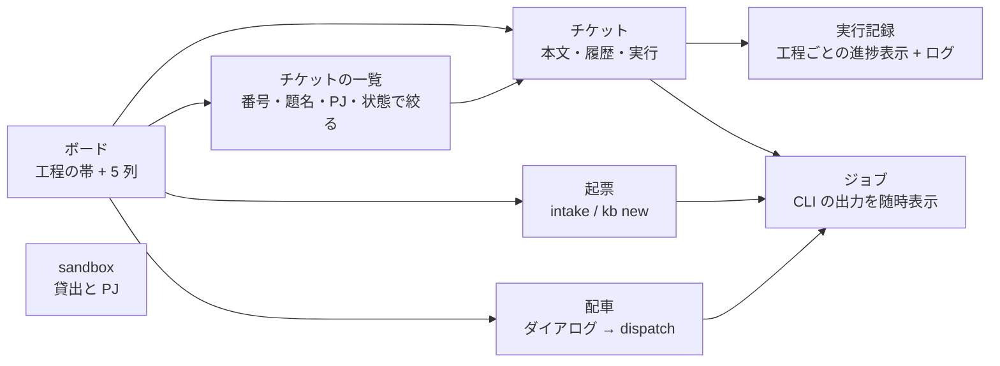

# Web コンソール

Web コンソールでは、チケットの状態、実行中のログ、VM の使用状況をブラウザで確認できます。チケットの作成や実行も画面から操作できるため、CLI のコマンドを覚えなくても日常の作業を進められます。

## 起動

```bash
console/bin/console --open        # http://127.0.0.1:8765/ をブラウザで開く
console/bin/console --port 9000   # ポートを変える
```

- Python 3 の標準ライブラリだけで動きます。npm も pip も要りません（runner と同じ `python3` で動かしてください）
- 既定で接続を受け付けるのは 127.0.0.1 だけで、認証はありません。制御系 LXC のように内側の網のアドレス（10.x / 192.168.x / 100.64.x など）で出すときは `--host <IP>`（または `CONSOLE_HOST`）だけでよく、合言葉は要りません。網の境界は tailnet と firewall が守ります。合言葉をかけたいときは環境変数 `CONSOLE_TOKEN` を置きます（`/?token=<合言葉>` で 1 回入ると cookie に残ります）。0.0.0.0 やグローバルアドレスに出すときは合言葉が必須です
- 止めるのは ++ctrl+c++。起動中のジョブ（`kb run` など）はコンソールを止めても続き、次に起動したときに一覧へ戻ります

常駐させるなら launchd に登録します。ログイン時に自動で起動し、落ちても再起動します。

```bash
console/bin/install.sh --launchd   # 登録。~/.local/bin/aifactory-console も作る
console/bin/install.sh --remove    # 解除
launchctl kickstart -k gui/$(id -u)/com.aifactory.console   # コードを変えたあと再起動
```

launchd の PATH は最小なので、登録時に「今のシェルの python3」の絶対パスと `claude` / `gh` / `jq` / `sandbox` の場所を plist に保存します。ログは `~/Library/Logs/aifactory-console.log` です。

## 画面



| 画面 | 見るもの | 押せるもの |
|---|---|---|
| ボード | 工程の帯（未着手 → 実行中 → レビュー待ち → 完了、横に人間待ち）と、同じ並びの 5 列のカード。動いている run は「実行中」の下に、今の工程と経過時間つきで出る。帯・列・run は PJ の絞り込みに連動し、対象範囲を帯の上に出す | 起票（「起票」へ）、配車（ダイアログで PJ・件数・dry-run を選ぶ。押す前に「次に回るチケット」が出る。未着手が無ければ押せない）、「一覧で探す」と完了列の「ほか n 件をすべて見る」（チケットの一覧へ） |
| チケットの一覧 | すべてのチケットを更新の新しい順に並べた表（番号・PJ・種別・題名・状態・PR・更新）。ボードの完了列は新しい 15 件までなので、あふれた分はここで見る。絞り込みの条件は URL に残り、詳細から戻っても消えない | 番号（前方一致）・題名（部分一致）・PJ・状態で絞る（AND）。行を押すとチケットへ |
| チケット | 本文（Markdown）、状態の履歴、関連する run とジョブ | `kb run`（ダイアログで PJ・ワークフロー・所要を確かめてから。dry-run / `--keep` / `--resume`。完了済みのチケットでは押せず、隣に「未着手に戻す（やり直す）」が出る。PJ に project.yml が無ければ実行のボタン自体が出ず、置き方を案内する）、状態を進める（開始 / レビュー待ち / 完了 / 未着手に戻す / 人間待ち。確認は出ず、トーストの「元に戻す」で戻せる）、種別・PR 番号・メモの修正、run 記録からの状態同期（押す前に対象の run と前後の状態・メモが出る。run の後にチケットが更新されていれば警告つき） |
| 実行記録 | `workspace/runs/` の一覧と、run ごとの工程ごとの進捗表示（工程の合否と所要、戻し ↺、終端 end / human）。ファイル一覧とログ。run を開くと冒頭に「結果」パネルが出て、結果・止まった工程と赤いゲート・チケットの今の状態が 1 文ずつ並び、記録から分からないときは分からないと書く。ファイルは成果物（報告・計画・検証結果）と工程のログ、その他（畳んである）に分かれる。**runner が居なくなった run は「実行中」ではなく「中断」**として並び、終わったジョブの日時・状態・終了コードと、待っても進まないことが出る。VM の準備（`sandbox take`）で失敗した run はエラーの要約が出る。記録が欠けているだけの run を「v0 の記録」とは呼ばず、時刻や工程が分からないことをそのまま書く | 理由を読む、報告を読む（どちらもその場でファイルを開く）、ジョブを開く、チケットを開く、sandbox を見る（VM が貸出中のままなら注記が出る）、実行記録に状態を合わせる（台帳の run がその run で、チケットがまだ実行中のときだけ出る） |
| sandbox | 貸出中の VM（task、VM 名、IP、プロジェクト、貸出からの時間、アプリの URL）とプロジェクトの一覧（project.yml とトークンファイルの有無、プールの使用数）、プール VM の一覧（貸出先・VM 名・IP・プロジェクト・稼働状態・貸出から）。貸出と稼働（VM の電源）は別の軸で、返却しても VM は止めないため貸出 0 台でも起動中が並ぶ。見出しに取得時刻が出て、取得中・失敗（理由の末尾とジョブへのリンク）・未取得を分けて表示する。同じ VM が複数のチケットに貸出中のとき（台帳に同じ vmid の項目が 2 つ以上あるとき）は、貸出の件数と VM の台数を分けて出し（「2 件（VM は 1 台）」）、共有している組を警告に並べ、行に「共有」の印を付ける。プールの使用数も台数で数える | `sandbox ls`（Proxmox に ssh、数秒）、`sandbox release`（その VM で run が動いているとき、または他のチケットと共有しているときはチケット番号を入力してから。共有時は返却で消える作業と、台帳に残る行を先に出す） |
| 起票 | 入力中の下書き（依頼文・PJ・種別・dry-run・題名・本文・PR 番号）。ほかの画面へ寄り道して戻っても、再読み込みやブラウザーの戻るでも残る（同じタブの中だけ。タブを閉じると消える）。復元したときは画面の上に「前回の下書きを復元しました。」が出る | 左は文章を LLM が題名と完了条件に整えて起票し、右は自分で書いた題名と本文をそのまま起票する（画面の言葉は「文章から整えて起票する」/「題名と完了条件を自分で書いて起票する」。CLI は `intake` / `kb new`）。どちらも登録するだけで、実行は始まらない（末尾にそう書き、チケットの「実行する」とボードの「配車する」へ導く）。種別を選ぶと「いつ選ぶか」がその場に出て、本文欄には `## 背景` と `## 完了条件` の雛形が薄く見える。配車はボードから。「下書きを捨てる」で明示的に消せる（トーストの「元に戻す」で書き戻せる）。送信できたときは、そのパネルの下書きだけが消える。PJ を選ぶと、その PJ に project.yml があるかを選択欄の下に出す（「実行できます」/「準備が必要」のバッジと説明。準備が必要なら置き場と sandbox 画面への導線が出る。起票そのものは止めない） |
| ジョブ | このコンソールが起動した CLI の一覧。出力を 2 秒ごとに継続的な読み取り。終わると「次にすること」（できたチケットを開く、止まった run の状態を合わせる、など）と、ジョブの終了日時・チケットの今の状態の 1 行。ジョブの後にチケットが完了などへ動いていれば、案内は過去形になり主ボタンは「チケットを開く」 | 止める（プロセスグループに SIGTERM） |
| ログ | 起票と配車の記録を 1 つの表に（日時・処理・PJ・チケット・結果・理由、新しい順）。`rc=` や見出しの無い数値ではなく、項目名と日本語で読める。表の下の「元のログを見る」に `workspace/logs/intake.log` / `workspace/logs/dispatch.log` の原文が畳んである。ログ形式は変えず、コンソール側で項目に分解している（ADR-0026） | チケット番号・PJ・種類（起票 / 配車）で絞る（AND、条件は URL に残る）。チケット番号のリンクでそのチケットへ |
| 設定 | ワークフローの流れ、モデルの経路（`routes.env`）、`git status` | — |

## 実行中の run を追う

run の画面は、実行中なら 5 秒ごとに更新され、**今動いている工程のログ**（`state.json` の `current` が指す `agent-*.log` / `code-*.log`）を自動で開きます。エージェントが担当する工程のログは、runner が `claude -p` のイベントを人が読める形に起こしたものです。

```
[+00:06] ▶ Read: /home/dev/app/hello.txt
  ↳
    1	hello, factory
[+00:14] ▶ Write: /home/dev/work/990/research.md
  ↳
    File created successfully at: …
[+00:18] result: success turns=5 duration=15s cost=$0.04
```

`▶` がツールの呼び出し、`↳` がその結果の先頭 3 行、時刻は工程の開始からの経過です。別のファイルを選ぶと、その run では自動で切り替わらなくなります。

## 約束

- **状態を変えるのは必ず既存の CLI**（`kb` / `intake` / `dispatch` / `sandbox`）。コンソールは `kanban.db` を読み取り専用で開き、`state.json` にも書きません。[複数セッションで作業する](multi-session.md) の約束をコンソールも守ります
- **時間のかかる操作はバックグラウンドで実行します**。`kb run` は 60 分を超えることがあるので、コンソールは子プロセスとして切り離し、出力を `console/jobs/<id>/log`（git 追跡外）に流します
- **重複する操作を防ぐ**。同じチケットの `kb run`、2 本目の `dispatch`、貸出中 task への `release` はロックの中で拒否されます
- **読めるファイルは限られる**。workspace（`runs/`、`kanban/tickets/`、`logs/`、`projects/`）、`examples/projects/`、`workflow/kit/`、`console/jobs/` だけ。トークンの中身は表示しません
- **確認の重さは操作の危険性に合わせています**。状態を進める・戻すは確認なしですぐ変わり、トーストの「元に戻す」で前の状態に戻せます。本番の run と配車は、何が起きるか（回るチケット、PJ、所要）を見せるダイアログを出します。状態同期は上書きになるので、前後の状態とメモを見せてから実行します。VM の返却とジョブの停止は危険色のダイアログで、その VM で run が動いていればチケット番号の入力を求めます
- **日時はブラウザーの時間帯で表示します**。記録の時刻はオフセット付き（`2026-09-08T00:21:00+00:00`）で、経過時間は記録と「今」の差だけで決まるので、どの時間帯のブラウザーで見ても同じ値になり、実行中と終了後で飛びません。ナビの左下に表示に使っている時間帯を出し、記録がそれと違う時間帯なら添えて知らせます。時刻の記録が無い項目は空欄ではなく「時刻の記録なし」と出ます。判断の記録は ADR-0026（[設計判断](../decisions/index.md)）
- ナビは使う頻度の順（ボード / 起票 / 実行記録 / ジョブ / sandbox / ログ / 設定）です。++g++ に続けて頭文字（++b++ ボード、++i++ 起票、++r++ 実行記録、++j++ ジョブ、++s++ sandbox、++l++ ログ、++c++ 設定）で移動でき、++question++ で一覧が出ます
- 画面の文言の約束（ボタンは動詞、文は「ですます」、用語集）はリポジトリの `console/UX.md` にあります。判断の記録は ADR-0019

## API

画面が利用する JSON API は `curl` からも呼び出せます。POST には `X-Console: 1` ヘッダが要ります（ブラウザの他サイトからは付けられないので、誤操作の防止になります）。

```bash
curl -s localhost:8765/api/overview
curl -s localhost:8765/api/tickets/204
curl -s -H 'Content-Type: application/json' -H 'X-Console: 1' -X POST localhost:8765/api/tickets/204/run -d '{"dry_run": true}'
```

| メソッドとパス | 内容 |
|---|---|
| `GET /api/overview` | 状態の件数、動いている run とジョブ、貸出数 |
| `GET /api/tickets[?pj=]` / `GET /api/tickets/<id>` | 一覧 / 本文・履歴・run・ジョブ。一覧は PJ 候補（`pjs`）と、その PJ に project.yml があるか（`pj_ready`）も返す |
| `GET /api/next[?pj=]` | 配車で次に回る todo（`kb next`）。無ければ `null` |
| `GET /api/tickets/<id>/sync-preview[?run=]` | 状態同期の下見（`kb sync --dry-run`）。前後の状態とメモ、run の後にチケットが更新されたか |
| `POST /api/tickets` | `kb new` |
| `POST /api/tickets/<id>/action` | `{action: start / review / done / reopen / block / set / sync, note, kind, pr}` |
| `POST /api/tickets/<id>/run` | `kb run` をジョブで。`{dry_run, workflow, keep, resume}` |
| `GET /api/runs` / `GET /api/runs/<name>` | 実行記録 |
| `GET /api/file?path=&tail=` | 許可されたディレクトリ内のファイル |
| `GET /api/sandbox` / `POST /api/sandbox/ls` / `POST /api/sandbox/release` | 貸出、一覧の取り直し、返却 `{task}` |
| `POST /api/intake` / `POST /api/dispatch` | `{text, pj, kind, dry_run}` / `{pj, once, max, dry_run}` |
| `GET /api/jobs` / `GET /api/jobs/<id>?offset=` / `POST /api/jobs/<id>/stop` | ジョブ一覧、出力の継続的な読み取り、停止 |
| `GET /api/logs` / `GET /api/config` | intake / dispatch のログ / ワークフローと routes と git |

## AI セッションから使う（MCP）

`.mcp.json` には **`aifactory-local`**（手元の workspace）と **`aifactory-ctl`**（Proxmox 上の制御系）の 2 つがあります。制御系を Proxmox 上の LXC に置いた構成（[貸出先ごとの環境（テナント）](tenants.md)）では `aifactory-ctl` を使うか、どのディレクトリからでも使えるよう user スコープで登録します（`claude mcp add --scope user aifactory -- <repo>/console/bin/mcp-remote`）。Codex CLI なら `codex mcp add aifactory -- <repo>/console/bin/mcp-remote`。stdio の MCP を話せるクライアントなら何でも同じ入口です。`console/bin/mcp-remote` が ssh 越しに LXC の MCP サーバーを起動するので、AI セッションは LXC 側の workspace と貸出状態をそのまま読み書きします。接続先は `~/.config/aifactory/mcp-remote.env` の `AIFACTORY_CTL`（既定 `aifactory@ctl.main.sb.internal`。別テナントは `aifactory@ctl.<tenant>.sb.internal`）、tailnet 未承認の間は `AIFACTORY_CTL_JUMP=<Proxmox ホストの ssh エイリアス>` です。追加後は `claude mcp reset-project-choices` で承認し直します。

同じ読み書きを MCP のツールとして出すサーバーが `console/bin/mcp` です。リポジトリ直下の `.mcp.json` に登録してあるので、このリポジトリで Claude Code を開くと初回に承認を求められ、以後 `mcp__aifactory__*` として使えます。

```bash
claude mcp list                    # aifactory が見える（プロジェクトスコープ）
claude mcp reset-project-choices   # 承認をやり直す
```

| ツール | 内容 |
|---|---|
| `overview` / `ticket_list` / `ticket_show` | 概況・一覧・1 件（本文・履歴・run・ジョブ） |
| `ticket_new` / `intake` | チケット作成（整った本文 / 自由文。intake はジョブ） |
| `ticket_action` | start / review / done / reopen / block / set / sync |
| `ticket_run` / `dispatch` | kb run（VM を貸し出して PR まで。`dry_run` 可）/ todo を順に。どちらもジョブ |
| `run_list` / `run_show` / `read_file` | 実行記録と、許可されたディレクトリ内のファイル（`agent-*.log` など） |
| `sandbox_status` / `sandbox_ls` / `sandbox_release` | 貸出状況 / 実機の状態確認（ジョブ）/ 返却（ジョブ） |
| `job_list` / `job_show` / `job_wait` / `job_stop` | ジョブの一覧・出力・待機（既定 60 秒・上限 300 秒）・停止 |
| `logs` / `config` | intake / dispatch のログ / ワークフロー・routes・プロジェクト・git |

`job_wait` は終わらなければ実行中のまま返るので、長く待ちたいときは繰り返し呼びます。待っている間も他のツールはすぐ応答します（ADR-0028）。

resources として `aifactory://board`（ボード）、`aifactory://ledger`（台帳）、`aifactory://ticket/<id>`（本文）も読めます。

コンソールと MCP は別プロセスですが、読み書きの本体は `console/lib/core.py` に 1 つで、ジョブ記録も共有します。AI が MCP で始めた run はブラウザのジョブ一覧に出ますし、その逆も同じです。判断の記録は ADR-0015。

## テスト

```bash
python3 -m unittest discover -s console/tests -v     # API とジョブ管理
python3 -m unittest discover -s workflow/tests -v    # runner の逐次ログ
```

テストは台帳を一時ディレクトリに複製して動く（`KB_ROOT` / `CONSOLE_JOBS`）ので、本番の DB もジョブ記録も触りません。CI（`.github/workflows/ci.yml`）でも同じテストが回ります。

判断の記録は ADR-0013（[設計判断](../decisions/index.md)）。
