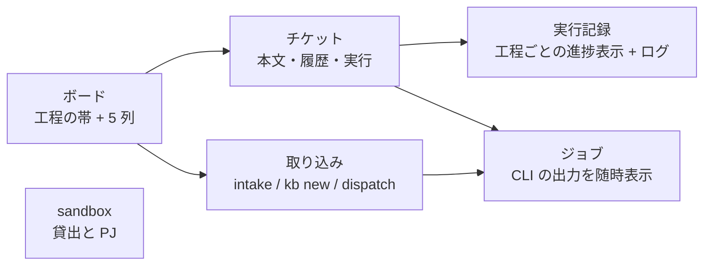

# Web コンソール

Web コンソールでは、チケットの状態、実行中のログ、VM の使用状況をブラウザで確認できます。チケットの作成や実行も画面から操作できるため、CLI のコマンドを覚えなくても日常の作業を進められます。

## 起動

```bash
console/bin/console --open        # http://127.0.0.1:8765/ をブラウザで開く
console/bin/console --port 9000   # ポートを変える
```

- Python 3 の標準ライブラリだけで動きます。npm も pip も要りません（runner と同じ `python3` で動かしてください）
- 接続を受け付けるのは 127.0.0.1 だけです。認証機能はなく、同じ Mac から利用する構成です
- 止めるのは ++ctrl+c++。起動中のジョブ（`kb run` など）はコンソールを止めても続き、次に起動したときに一覧へ戻ります

常駐させるなら launchd に登録します。ログイン時に自動で起動し、落ちても再起動します。

```bash
console/bin/install.sh --launchd   # 登録。~/.local/bin/aifactory-console も作る
console/bin/install.sh --remove    # 解除
launchctl kickstart -k gui/$(id -u)/com.aifactory.console   # コードを変えたあと再起動
```

launchd の PATH は最小なので、登録時に「今のシェルの python3」の絶対パスと `claude` / `gh` / `jq` / `sandbox` の場所を plist に保存します。ログは `~/Library/Logs/aifactory-console.log` です。

## 画面



| 画面 | 見るもの | 押せるもの |
|---|---|---|
| ボード | 工程の帯（未着手 → 実行中 → レビュー待ち → 完了、横に人間待ち）と 5 列のカード。動いている run は「実行中」の下に、今の工程と経過時間つきで出る | チケットの作成（「取り込み」へ）、1 件の実行（「配車 1 件」） |
| チケット | 本文（Markdown）、状態の履歴、関連する run とジョブ | `kb run`（dry-run / ワークフローの上書き / `--keep` / `--resume`）、状態を進める（開始 / レビュー待ち / 完了 / 未着手に戻す / 人間待ち）、種別と PR 番号の修正、run 記録からの状態同期 |
| 実行記録 | `workspace/runs/` の一覧と、run ごとの工程ごとの進捗表示（工程の合否と所要、戻し ↺、終端 end / human）。ファイル一覧とログ | — |
| sandbox | 貸出中の VM（task、VM 名、IP、プロジェクト、貸出からの時間、アプリの URL）とプロジェクトの一覧（project.yml とトークンファイルの有無、プールの使用数） | `sandbox ls`（Proxmox に ssh、数秒）、`sandbox release` |
| 取り込み | — | 自由文 → `intake`、整った本文 → `kb new`、todo → `dispatch`（プロジェクト、件数、dry-run） |
| ジョブ | このコンソールが起動した CLI の一覧。出力を 2 秒ごとに継続的な読み取り | 止める（プロセスグループに SIGTERM） |
| ログ | `workspace/logs/intake.log` / `workspace/logs/dispatch.log` | — |
| 設定 | ワークフローの流れ、モデルの経路（`routes.env`）、`git status` | — |

## 実行中の run を追う

run の画面は、実行中なら 5 秒ごとに更新され、**今動いている工程のログ**（`state.json` の `current` が指す `agent-*.log` / `code-*.log`）を自動で開きます。エージェントが担当する工程のログは、runner が `claude -p` のイベントを人が読める形に起こしたものです。

```
[+00:06] ▶ Read: /home/dev/app/hello.txt
  ↳
    1	hello, factory
[+00:14] ▶ Write: /home/dev/work/990/research.md
  ↳
    File created successfully at: …
[+00:18] result: success turns=5 duration=15s cost=$0.04
```

`▶` がツールの呼び出し、`↳` がその結果の先頭 3 行、時刻は工程の開始からの経過です。別のファイルを選ぶと、その run では自動で切り替わらなくなります。

## 約束

- **状態を変えるのは必ず既存の CLI**（`kb` / `intake` / `dispatch` / `sandbox`）。コンソールは `kanban.db` を読み取り専用で開き、`state.json` にも書きません。[複数セッションで作業する](multi-session.md) の約束をコンソールも守ります
- **時間のかかる操作はバックグラウンドで実行します**。`kb run` は 60 分を超えることがあるので、コンソールは子プロセスとして切り離し、出力を `console/jobs/<id>/log`（git 追跡外）に流します
- **重複する操作を防ぐ**。同じチケットの `kb run`、2 本目の `dispatch`、貸出中 task への `release` はロックの中で拒否されます
- **読めるファイルは限られる**。workspace（`runs/`、`kanban/tickets/`、`logs/`、`projects/`）、`examples/projects/`、`workflow/kit/`、`console/jobs/` だけ。トークンの中身は表示しません
- 本番の run、返却、停止は確認ダイアログを出します

## API

画面が利用する JSON API は `curl` からも呼び出せます。POST には `X-Console: 1` ヘッダが要ります（ブラウザの他サイトからは付けられないので、誤操作の防止になります）。

```bash
curl -s localhost:8765/api/overview
curl -s localhost:8765/api/tickets/204
curl -s -H 'Content-Type: application/json' -H 'X-Console: 1' -X POST localhost:8765/api/tickets/204/run -d '{"dry_run": true}'
```

| メソッドとパス | 内容 |
|---|---|
| `GET /api/overview` | 状態の件数、動いている run とジョブ、貸出数 |
| `GET /api/tickets[?pj=]` / `GET /api/tickets/<id>` | 一覧 / 本文・履歴・run・ジョブ |
| `POST /api/tickets` | `kb new` |
| `POST /api/tickets/<id>/action` | `{action: start / review / done / reopen / block / set / sync, note, kind, pr}` |
| `POST /api/tickets/<id>/run` | `kb run` をジョブで。`{dry_run, workflow, keep, resume}` |
| `GET /api/runs` / `GET /api/runs/<name>` | 実行記録 |
| `GET /api/file?path=&tail=` | 許可されたディレクトリ内のファイル |
| `GET /api/sandbox` / `POST /api/sandbox/ls` / `POST /api/sandbox/release` | 貸出、一覧の取り直し、返却 `{task}` |
| `POST /api/intake` / `POST /api/dispatch` | `{text, pj, kind, dry_run}` / `{pj, once, max, dry_run}` |
| `GET /api/jobs` / `GET /api/jobs/<id>?offset=` / `POST /api/jobs/<id>/stop` | ジョブ一覧、出力の継続的な読み取り、停止 |
| `GET /api/logs` / `GET /api/config` | intake / dispatch のログ / ワークフローと routes と git |

## AI セッションから使う（MCP）

同じ読み書きを MCP のツールとして出すサーバーが `console/bin/mcp` です。リポジトリ直下の `.mcp.json` に登録してあるので、このリポジトリで Claude Code を開くと初回に承認を求められ、以後 `mcp__aifactory__*` として使えます。

```bash
claude mcp list                    # aifactory が見える（プロジェクトスコープ）
claude mcp reset-project-choices   # 承認をやり直す
```

| ツール | 内容 |
|---|---|
| `overview` / `ticket_list` / `ticket_show` | 概況・一覧・1 件（本文・履歴・run・ジョブ） |
| `ticket_new` / `intake` | チケット作成（整った本文 / 自由文。intake はジョブ） |
| `ticket_action` | start / review / done / reopen / block / set / sync |
| `ticket_run` / `dispatch` | kb run（VM を貸し出して PR まで。`dry_run` 可）/ todo を順に。どちらもジョブ |
| `run_list` / `run_show` / `read_file` | 実行記録と、許可されたディレクトリ内のファイル（`agent-*.log` など） |
| `sandbox_status` / `sandbox_ls` / `sandbox_release` | 貸出状況 / 実機の状態確認（ジョブ）/ 返却（ジョブ） |
| `job_list` / `job_show` / `job_wait` / `job_stop` | ジョブの一覧・出力・待機（上限 570 秒）・停止 |
| `logs` / `config` | intake / dispatch のログ / ワークフロー・routes・プロジェクト・git |

resources として `aifactory://board`（ボード）、`aifactory://ledger`（台帳）、`aifactory://ticket/<id>`（本文）も読めます。

コンソールと MCP は別プロセスですが、読み書きの本体は `console/lib/core.py` に 1 つで、ジョブ記録も共有します。AI が MCP で始めた run はブラウザのジョブ一覧に出ますし、その逆も同じです。判断の記録は ADR-0015。

## テスト

```bash
python3 -m unittest discover -s console/tests -v     # API とジョブ管理
python3 -m unittest discover -s workflow/tests -v    # runner の逐次ログ
```

テストは台帳を一時ディレクトリに複製して動く（`KB_ROOT` / `CONSOLE_JOBS`）ので、本番の DB もジョブ記録も触りません。CI（`.github/workflows/ci.yml`）でも同じテストが回ります。

判断の記録は ADR-0013（[設計判断](../decisions/index.md)）。
