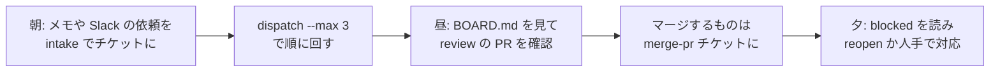

# 使い方

チケットの作成、実行、結果の確認など、日常の操作を目的別に説明します。コマンドの全オプションは [リファレンス](../reference/index.md) を参照してください。

| やりたいこと | ページ |
|---|---|
| MacのmacOS VMでチケットを実行する。導入・監視・復旧を確認する | [Mac ワーカーの導入と運用](macos-worker.md) |
| Windows VMでチケットを実行する。サービス導入と復旧 | [Windowsワーカーの導入と運用](windows-worker.md) |
| 依頼をチケットにする（自由文から / 整った本文から） | [チケットを作る](tickets.md) |
| チケットを実行する（1 件ずつ / まとめて / dry-run） | [実行する](running.md) |
| PR・ログ・成果物・状態を読む | [結果を読む](results.md) |
| ブラウザで見て、ボタンで動かす | [Web コンソール](console.md) |
| 新しいリポジトリを工場に入れる | [プロジェクトを追加する](add-project.md) |
| hotfix / bug / feature / chore / research / merge-pr の使い分け | [ワークフローの選び方](workflows.md) |
| トークン更新、プール、テンプレート更新、障害対応 | [日々の運用](operations.md) |
| 複数の AI セッションや人が同時に触るときの約束 | [複数セッションで作業する](multi-session.md) |
| 別の組織に貸し出す。網・VM・権限・秘密情報を分け、console / docs も Proxmox 上で完結させる | [貸出先ごとの環境（テナント）](tenants.md) |

## 1 日の流れの例

- チケット化は数十秒、実行は 1 件 5〜60 分。実行中は別のことをしていてよい
- 状態は `workspace/kanban/BOARD.md` に常に出ている。`kb list` でも同じ。ブラウザなら [Web コンソール](console.md)
- 人間が触るのは PR のレビューと、`blocked`（人間待ち）になったものだけ

- [Mac・Windowsの画面操作](computer-use.md): MCPやチケットから専用VMのGUIを操作する。

- [単体Linuxワーカー](linux-worker.md): Proxmoxに依存せず、CLIと専用X11画面を操作する。
