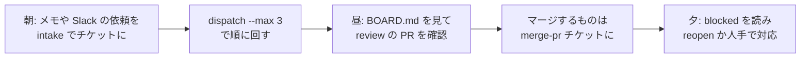

# 使い方

日常の操作を、やりたいことの順に並べています。コマンドの全オプションは [リファレンス](../reference/index.md) にあります。

| やりたいこと | ページ |
|---|---|
| 依頼をチケットにする（自由文から / 整った本文から） | [チケットを作る](tickets.md) |
| チケットを回す（1 件ずつ / まとめて / dry-run） | [実行する](running.md) |
| PR・ログ・成果物・状態を読む | [結果を読む](results.md) |
| ブラウザで見て、ボタンで動かす | [Web コンソール](console.md) |
| 新しいリポジトリを工場に入れる | [PJ を追加する](add-project.md) |
| hotfix / bug / feature / chore / research / merge-pr の使い分け | [workflow の選び方](workflows.md) |
| トークン更新、プール、テンプレート更新、障害対応 | [日々の運用](operations.md) |
| 複数の AI セッションや人が同時に触るときの約束 | [複数セッションで作業する](multi-session.md) |

## 1 日の流れの例

- チケット化は数十秒、実行は 1 件 5〜60 分。実行中は別のことをしていてよい
- 状態は `workspace/kanban/BOARD.md` に常に出ている。`kb list` でも同じ。ブラウザなら [Web コンソール](console.md)
- 人間が触るのは PR のレビューと、`blocked`（人間待ち）になったものだけ
