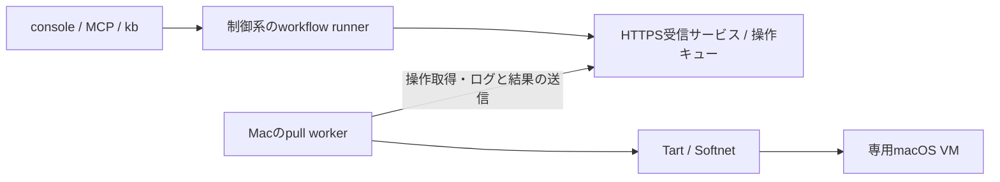

# Macワーカーの導入と運用

初回導入は [ワンライナーで導入する](worker-install.md) を参照。

2026-09-07 / macOS VMでの文書整備からPR作成・VM返却まで実機確認済み。

aifactoryは、Apple Silicon Mac上のmacOS VMをチケットの実行先にできる。制御系はProxmox上に置いたまま、Mac上のGo製ワーカーがHTTPSで仕事を取得する。利用者は通常と同じMCPの `ticket_run` または `kb run` から依頼する。

この文書は現在の運用ガイド。[連携検討メモ](https://github.com/akkijp-oss/aifactory/blob/main/docs/macos-worker-study.md)は実装前の調査記録、[ADR-0018](https://github.com/akkijp-oss/aifactory/blob/main/docs/adr/0018-macos-pull-worker.md)は通信基盤の判断、[ADR-0020](https://github.com/akkijp-oss/aifactory/blob/main/docs/adr/0020-macos-workflow-backend.md)はworkflow統合の判断を記録している。

## 構成と実行の流れ



1. runnerがMacワーカーの準備状態を調べ、run単位の予約（lease）を取得する。
2. Macが停止中の基準VMを複製し、専用ゲストを起動する。
3. ゲスト内でPJの `provision.sh` を実行し、認証情報を渡してリポジトリをcloneする。
4. 同じゲストで計画・実装・ゲート・レビューを進める。`docs` workflowは必要に応じて修正へ戻り、合格後にPRを作成する。
5. 成果物を制御系へ回収してハッシュを照合し、ゲストを停止・削除して予約を解放する。PRは人間のレビュー待ちになる。

チケット台帳とrunの正本は制御系にある。制御系からMacへのSSH接続は実行経路に使わず、ゲストへの操作はMacが `tart exec` で仲介する。管理者のSSHによるホスト設定・復旧は別の経路である。

## 初回セットアップ

### 1. 制御系を準備する

[workersの制御系手順](https://github.com/akkijp-oss/aifactory/blob/main/workers/README.md#制御系)に従って、ワーカー用HTTPSサービス、SQLite DB、TLS証明書、ワーカーごとのトークンを用意する。Macから受信口（既定8766/TCP）へ到達できるようにする。consoleの認証とは別で、TLS検証を無効にしない。

サービスとrunnerは同じ操作DBを参照する。runnerの指定は `AIFACTORY_WORKER_DB`、既定は `$AIFACTORY_WORKSPACE/workers/queue.sqlite3`。ワーカー登録は制御系の管理CLIで行い、トークンと必要なCA証明書を信頼できる管理経路でMacへ配布する。

### 2. Macホストと基準VMを準備する

- Apple Silicon MacにTartとSoftnetを用意する。GoやPythonはワーカーバイナリ自体の実行には不要。
- 基準VMはTart Guest AgentとPython 3を含むmacOS VMとし、停止しておく。ホストのXcodeやCLIはゲストに引き継がれない。
- 基準VMに個人アカウント、署名鍵、実行トークンを保存しない。専用ゲストには未使用の名前を指定する。
- 取得元・版・digestとゲストOSを記録する。`latest` という名前だけでは再現できない。実機固有の記録は非追跡の `$AIFACTORY_WORKSPACE/docs/` に置く。

ワーカーの設定例とバイナリのビルド方法は [workers/README.md](https://github.com/akkijp-oss/aifactory/blob/main/workers/README.md) にある。`base_vm` はローカルの基準VM名、`guest_vm` はタスク用の専用ゲスト名。現在の割当は1ワーカーにつき同時1 run、ゲストは4 CPU・8 GiB固定である。

Softnetには管理者によるroot所有・SUID設定が必要。Homebrewで導入した場合は、対象を確認して設定する。

```bash
softnet_binary="$(/opt/homebrew/bin/brew --prefix softnet)/bin/softnet"
sudo chown root:wheel "$softnet_binary"
sudo chmod u+s "$softnet_binary"
stat -f '%Su %Sg %Sp %N' "$softnet_binary"
```

所有者 `root`、グループ `wheel`、所有者の実行権限欄に `s` があることを確認する。初期実装の準備判定はこのSUID方式を対象にする。Softnet更新後は再確認する。

### 3. ワーカーを常駐させる

[LaunchAgentテンプレート](https://github.com/akkijp-oss/aifactory/blob/main/workers/templates/com.aifactory.worker.plist)の `@BINARY@`、`@CONFIG@`、`@LOGDIR@` を絶対パスに置き換え、`~/Library/LaunchAgents/com.aifactory.worker.plist` に配置する。ログディレクトリは先に作り、XMLの特殊文字をエスケープする。

```bash
launchctl bootstrap "gui/$(id -u)" "$HOME/Library/LaunchAgents/com.aifactory.worker.plist"
launchctl print "gui/$(id -u)/com.aifactory.worker"
```

Tartの絶対パスを設定しても、Tartが呼ぶSoftnetを見つけるPATHは別に必要。テンプレートは `/opt/homebrew/bin` を含む。plist変更時は稼働中の操作がないことを確認し、`launchctl bootout "gui/$(id -u)/com.aifactory.worker"` の後にbootstrapで再読込する。バックアップのplistはLaunchAgentsの外へ置く。

LaunchAgentなのでログイン前の稼働は保証しない。ホストのスリープ、再起動後のログイン、空きメモリ・ディスクは運用側で確認する。

### 4. PJを登録する

制御系の `$AIFACTORY_WORKSPACE/projects/<pj>/project.yml` に指定する最小構成:

```yaml
name: example-mac
repo: example-org/example-app
base_branch: main
backend: macos-pull
worker: mac-worker-01
app_dir: /Users/admin/app
gates: gates.sh
```

1400px幅のようにゲストの画面を広げたいPJは `display` を足す。

```yaml
display:
  width: 1600
  height: 1000
```

`display` を書いたPJは、prepareが停止中のクローンへ `tart set <guest_vm> --display 1600x1000` を実行してから起動する。ワーカー設定 `config.json` の `display` は同じワーカーを使う全PJの既定で、優先順位はPJ定義 > ワーカー設定 > 指定なし（基準VMの1024×768）。指定できる範囲は幅800〜2560・高さ600〜2560で、`width` と `height` の両方が要る。`scale` は未対応（[ADR-0057](https://github.com/akkijp-oss/aifactory/blob/main/docs/adr/0057-guest-display-resolution.md)）。ゲストの割当は解像度に関係なく4 CPU・8 GiB固定のまま。screenshotを実解像度で受け取るには、ゲストの `desktop-native` を2560px対応版へ入れ替えて基準VMを作り直す必要がある（[Mac・Windowsの画面操作](computer-use.md)）。

`worker` は登録済みIDと一致させ、`app_dir` はゲストのアカウントに合わせる。同じディレクトリにPJ用の `gates.sh` と、必要なら `provision.sh` を置く。ゲートは製品と変更内容に合う検証を行い、失敗時は非ゼロで終了する。

ゲストにはrunner用の `gh`、Claude CLI、GNU `timeout` などが必要。provisionは認証注入前に動き、ツールを準備する。cloneはrunnerが行う。既存ツールの再ダウンロードを避けるなど、provisionは再実行可能にしておく。Linux用のパスやパッケージ管理コマンドをそのまま流用しない。何が既に入っているかはこの下の「基準イメージの中身」の節を先に読む。雛形は [workers/templates/provision.macos.sh](https://github.com/akkijp-oss/aifactory/blob/main/workers/templates/provision.macos.sh)。

制御系にはsandboxのPJ別GitHub App設定とClaude OAuthトークンを用意する。GitHub Appの対象リポジトリへのインストールとPR作成に必要な権限を確認する。値をPJ定義・チケット・ログへ書かない。

鍵の出どころ: **Claude の鍵は制御系の鍵プール（`~/.config/sandbox/keys.json`）が正本**で、runnerが工程ごとに`sandbox keys pick` を呼び、モデル系統ごとに選んだ鍵をゲストの `runtime.env` に渡す（ADR-0044 / ADR-0046）。鍵を無効化すると次の工程から別の鍵に変わる。プールが空のときだけ `pj/<pj>.env` と `env` の鍵を互換として使い、どちらにも鍵が無ければ**runnerのプロセスに残っている値には落ちず**、runを「鍵なし」で一時停止して鍵の登録を待つ。consoleとMCPが起動するジョブの鍵も `~/.config/aifactory/ctl.env` が正本で、ジョブごとに読み直す。

## 基準イメージの中身

`provision.sh` を書く前に、専用ゲストへ**既に入っているもの**を把握する。入っているものを入れ直すと壊れる。2026-09-09、あるPJの `provision.sh` が `brew install gh coreutils node@24 pnpm` を無条件に実行し、既にある `pnpm` とHomebrewが置こうとした `/opt/homebrew/bin/pn` のリンクが衝突して、provisionが非ゼロで終了した。

### 中身は3つの層でできている

どの層で入ったかで、入れ直してよいかが変わる。

| 層 | 誰がいつ | 入るもの |
|---|---|---|
| 1. 上流の基準イメージ | Cirrus Labsが公開しているTart用イメージ | Homebrew、Xcode Command Line Tools、gh、node@24、`npm -g` のpnpm / yarn、mise、rbenv、Tart Guest Agentなど。Xcode入りの系統ならXcodeとcask版のClaude Code |
| 2. 専用基準VM | 管理者が[ワンライナー導入](worker-install.md)で1回 | `brew install python gh coreutils`、`claude`（無ければ公式スクリプト）、画面操作ヘルパー、ゲストのDNSとIPv6の設定（`workers/bootstrap/install.py`） |
| 3. 専用ゲスト | runnerがrunごとに、PJの `provision.sh` を1回 | そのPJだけに要るもの |

イメージは2系統ある。どちらを使っているかは実機で確認する。

| 系統 | イメージ | 補足 |
|---|---|---|
| 素のmacOS | `ghcr.io/cirruslabs/macos-sequoia-base` | 導入スクリプトの既定。`AIFACTORY_MAC_IMAGE` で変更できる |
| Xcode入り | `ghcr.io/cirruslabs/macos-tahoe-xcode` | 上にXcode・Android SDK・cask類を足したもの。ディスクを大きく使う |

`latest` という名前だけでは再現しない。取得のたびにdigestとゲストOSを記録する（この節の「版とdigestを採取する」）。

### ゲストでコマンドが動く形

`command -v` が何を見つけるかは、この形で決まる。

- ワーカーはゲスト操作を `tart exec <guest> /bin/bash -lc '<command>'` で実行する（`workers/cmd/aifactory-worker/main.go`）。**ログインシェル**なので `~/.profile` を読む。上流イメージは `~/.profile` を `~/.zprofile` へのsymlinkにしてあるので、`~/.zprofile` が足すPATH（`node@24`、`PNPM_HOME`、`openjdk@17` など）も効く（上流のイメージ定義から。2026-09-10参照。この1文だけ実機で未確認なので、実機では `ls -l ~/.profile` と `command -v node` で確かめる）。`~/.bash_profile` や `~/.bash_login` を作るとこのsymlinkが読まれなくなるので、provisionで作らない。
- runnerはその上で、コマンドの先頭に固定のPATHを足す（`workflow/lib/macos.py`）。

    ```
    /opt/homebrew/opt/coreutils/libexec/gnubin:/opt/homebrew/bin:$HOME/.local/bin:$HOME/.cargo/bin:$PATH
    ```

- `provision.sh` はこのPATHを継いだ `bash provision.sh` として走る。ログインシェルの子なので `~/.zprofile` の分もそのまま見える。

### 入っているもの

次の表は上流のイメージ定義（`cirruslabs/macos-image-templates` の `templates/base.pkr.hcl` と `templates/xcode.pkr.hcl`。2026-09-10参照）と本リポジトリのコードから書いている。**版の数値は書かない。実機の採取結果を正とする。**

| ツール | 入り方 | 実体 | runnerのPATHで見えるか | provisionで入れてよいか |
|---|---|---|---|---|
| brew | Homebrewの導入スクリプト | `/opt/homebrew/bin/brew` | 見える | 入れない |
| git | Xcode Command Line Tools（Homebrew導入時に入る） | `/usr/bin/git` | 見える | 入れない |
| python3 | 同上。層2で `brew install python` も入る | `/usr/bin/python3`、`/opt/homebrew/bin/python3` | 見える | 入れない |
| gh | brewのformula `gh`（層1と層2） | `/opt/homebrew/bin/gh` | 見える | `command -v` で守れば可。実質no-op |
| node | brewのformula `node@24`。**keg-only** で `/opt/homebrew/bin` にはリンクされない | `/opt/homebrew/opt/node@24/bin/node` | 見える（`~/.zprofile` のPATH経由。実機で要確認） | 入れない |
| npm | `node@24` 同梱。formulaが `npmrc` に `prefix = /opt/homebrew` を書くので、`npm install -g` した実行ファイルは `/opt/homebrew/bin` に出る | `/opt/homebrew/opt/node@24/bin/npm` | 見える（同上。実機で要確認） | 入れない |
| pnpm / yarn | `npm install --global yarn pnpm`（層1） | `/opt/homebrew/bin/pnpm`、`/opt/homebrew/bin/yarn` | 見える | **brewで入れない**（下記） |
| Xcode | `xcodes` で導入し `xcode-select` で選択済み（Xcode入りの系統のみ） | `/Applications/Xcode_<版>.app` | 見える（`xcodebuild` は `/usr/bin` 経由） | 入れない |
| claude | caskの `claude-code`（Xcode入りの系統）、または層2の公式スクリプト | `/opt/homebrew/bin/claude` か `$HOME/.local/bin/claude` | 見える | 無ければ入れる |
| timeout（GNU） | brewのformula `coreutils`。**上流イメージには入っていない**。層2で入る | `/opt/homebrew/opt/coreutils/libexec/gnubin/timeout` | 見える | 無ければ入れる |

上流イメージにはほかに mise / rbenv / git-lfs / jq / yq / awscli / wget / unzip / zip / cmake / gcc / gitlab-runner / Tart Guest Agent が入る。Xcode入りの系統にはさらに openjdk@17 / xcodes / Android SDK / codex / amazon-q が入る。

### 入れ直してはいけないもの

見分ける規則は1つ。

> **brewが入れたものを `brew install` し直すのは無害**（「already installed」で終わる）。**brew以外**（`npm -g`、caskのbinary、`curl | bash`）が同じ場所に置いたファイルをbrewのformulaで入れようとすると、リンクが衝突して非ゼロで落ちる。

- **`pnpm` / `yarn`**: 上流イメージは `npm install --global` で入れていて、`npm` のprefixが `/opt/homebrew` なので実行ファイルは `/opt/homebrew/bin` にある。Homebrewの `pnpm` formulaは `pnpm` に加えて `pn` / `pnpx` / `pnx` を同じ場所へ置くため、`brew install pnpm` がリンクで衝突する。2026-09-09に踏んだのはこれ。pnpmが要るなら入っているものを使う。版を固定したいならリポジトリの `packageManager` と `corepack` に任せる
- **`node` / `node@24`**: keg-onlyなので `/opt/homebrew/bin/node` は無いが、入っていないわけではない。別系統のnodeを足すとPATHの先勝ちで版が入れ替わる。`command -v node` が空に見えたら、まず「ログインシェルで走っているか」「`~/.bash_profile` を作っていないか」を疑う
- **`gh`**: 層1と層2の両方で入っている。`brew install gh` は落ちないが、毎runの無駄な待ち時間になる
- **`claude`**: Xcode入りの系統はcaskで `/opt/homebrew/bin/claude` に入っていることがある。公式スクリプトで入れると `$HOME/.local/bin/claude` になり、runnerのPATHでは `/opt/homebrew/bin` の方が先に来る。二重に入れて版がずれないよう `command -v` で守る

### 既存を守る書き方

```bash
command -v gh      >/dev/null || brew install gh
command -v timeout >/dev/null || brew install coreutils
command -v claude  >/dev/null || curl -fsSL https://claude.ai/install.sh | bash
```

keg-onlyのものを確実に使いたいときは、入れ直さずにPATHを足す。

```bash
if [ -d /opt/homebrew/opt/node@24/bin ]; then
  export PATH="/opt/homebrew/opt/node@24/bin:$PATH"
fi
```

雛形は [workers/templates/provision.macos.sh](https://github.com/akkijp-oss/aifactory/blob/main/workers/templates/provision.macos.sh)。ネットワーク隔離の確認とこの3つだけが入っている。PJ固有の追加は雛形が指す位置から下に足す。

### 版とdigestを採取する

版もdigestも環境ごとに違うので、この文書には数値を書かない。実機で採取して、非追跡の `$AIFACTORY_WORKSPACE/docs/STATUS.md` へ日付つきで貼る。

```bash
db="$AIFACTORY_WORKSPACE/workers/queue.sqlite3"
python3 workers/bin/control --db "$db" submit <worker> guest-exec --lease auto --wait 120 \
  --command 'sw_vers; brew --version; brew list --versions; which -a node npm pnpm yarn python3 gh git brew claude timeout; xcodebuild -version'
```

`--command` で渡すと、payloadの `timeout` は60秒が既定（`workers/bin/control`）。`--wait` はこちらの待ち時間で、ゲスト側の上限ではない。Xcode入りで `brew list --versions` が60秒を超えるなら、payloadファイルに `timeout` を書いて `--payload-file` で渡す。

`guest-exec` は専用ゲストが起きていてleaseがある間しか通らない（「uncertainからの復旧」の節）。`kb run <id> --keep` で保持したrunのleaseを使う。Xcodeの無い系統では最後の `xcodebuild -version` だけが失敗するが、手前の出力は取れる。

取得元のdigestは、イメージを取得したMacで確認する。

```bash
image=cirruslabs/macos-tahoe-xcode
token=$(curl -sS "https://ghcr.io/token?scope=repository:$image:pull" | python3 -c 'import sys,json; print(json.load(sys.stdin)["token"])')
curl -sS -o /dev/null -D - -H "Authorization: Bearer $token" \
  -H 'Accept: application/vnd.oci.image.index.v1+json' \
  "https://ghcr.io/v2/$image/manifests/latest" | grep -i docker-content-digest
```

**基準イメージを更新したら、この節と `$AIFACTORY_WORKSPACE/docs/STATUS.md` の採取結果を同じ日に更新する。**

## 依頼と進捗確認

以下は制御系のリポジトリルートから実行する。`AIFACTORY_WORKSPACE` はその環境の運用ディレクトリに設定しておく。

```bash
python3 workers/bin/control --db "$AIFACTORY_WORKSPACE/workers/queue.sqlite3" list
kanban/bin/kb new example-mac docs 'READMEを現行実装に合わせて整備する' --body /path/to/ticket.md
kanban/bin/kb run <発行されたID> --dry-run
kanban/bin/kb run <発行されたID>
```

MCPでは同じチケットに `ticket_run` を呼び、返されたjob IDを `job_wait` / `job_show` で追う。`run_show` から実run名とログのパスを確認し、`read_file` で工程のログを読む。長い処理でも重複したrunを開始しない。dry-runは依頼文・構成の確認であり、VMの実行確認ではない。

ワーカーの `online` と `info` 内の `lifecycle`・`base_ready`・`network_ready`、予約状態を確認する。直接開始したrunは、onlineのワーカーの基準VM・Softnet準備を最大6時間待てる（`AIFACTORY_MAC_PREPARE_WAIT_S` で変更）。その間はVMもleaseも割り当てない。dispatchは未準備・offline・予約中のワーカーを見送る。

ワーカーはPJを跨いで共有する1台である（`project.yml` の `worker` に同じidを書いた複数のPJが同じMacを使う）。別のrunがleaseを持っている間、`kb run <ID> --wait <分>` はそのleaseが空くまで最大その分数だけ待ってから開始する。待っている間は `state.json` の `current` が `wait-vm` になり、consoleには「VMの空き待ち」と出る（VMもleaseも割り当てない）。上限まで空かなかったrunと `--wait` を付けなかったrunは、チケットをblockedにせずtodoのまま残し、`state.json` の `wait_reason` とチケットのnoteに「どのrunがいつから使っているか」を書く。空き次第dispatchが同じチケットを拾うので、人が投入し直す必要はない。offlineやlifecycle未設定のワーカーは待たずに人へ返す（ADR-0049）。

## 成果物と終了確認

`$AIFACTORY_WORKSPACE/runs/<run>/` に記録される。

| 記録 | 確認すること |
|---|---|
| `state.json` | 工程履歴、PR URL、backend・worker・lease、`artifacts_received` と `released`、回収しなかった名前の `artifacts_skipped`、退避先の `wip_branch` |
| `agent-*.log` / `code-*.log` | 実行内容、ゲート・レビューの判定、ゲストOSなどの検証根拠 |
| `worker-operations.log` | ワーカー操作ID。管理CLIの `show` と対応づける |
| `work/` | 計画・報告・レビュー・ゲート結果・PR URLなど |
| `artifacts.json` | 回収ファイルのSHA-256 |

PR後の `result: human` は人間によるレビュー待ちを表す。これだけで失敗と判断せず、工程履歴とPRを確認する。通常終了ではゲストがTartの一覧から消え、制御系のleaseが空になる。`--keep` を付けた場合は成果物回収後もゲストとleaseを保持する。

PRを作る前にhumanへ落ちたrun（ゲートの戻せる回数を使い切った、工程が失敗したなど）は、成果物回収の前に作業ブランチのHEADを `sandbox/<チケット番号>-<workflow名>-wip` へforce pushし、そのブランチ名を `state.json` の `wip_branch` に記録する。人はこのブランチを取り出して続きを引き取れる。pushできなかった場合は `wip_branch` を空にし、代わりに差分を `wip.patch`（`git am` で当てられる）としてrunディレクトリに残す。保全が成功しても失敗しても、成果物回収とゲスト削除は続行する。

成果物はゲスト作業ディレクトリ直下の通常ファイル、合計4 MiBまで。入力転送は1ファイル350,000バイトまで。認証用 `runtime.env` は除外する。ディレクトリ・symlink・合計4 MiBを超える分は回収せず飛ばし、その名前と理由を `state.json` の `artifacts_skipped` に残す。回収対象外があってもrunは止めず、VMは返却する。大きなビルド成果物や `.xcresult` の回収は、この経路では扱えない。

## 失敗時の復旧

| 症状 | 確認・対処 |
|---|---|
| `network_ready` がfalse | LaunchAgentのPATH、Softnetのroot所有・SUIDを確認する |
| `base_ready` がfalse | 設定したローカル基準VMが存在するか、イメージ取得が完了したかを確認する |
| CLI導入が長時間かかる | provisionログで進行・再取得を確認する。取得済みという理由だけで未検証のバイナリを配置しない |
| GitHub token発行に失敗 | PJ設定とAppのインストール権限を確認する。runnerは同じリポジトリ内のsandbox CLIを呼ぶ。値をログへ出さない |
| 日付をまたいで再開する | `kb run <id> --resume`。チケットに記録されたrunを使う |
| 操作が `uncertain` | ゲスト停止と操作状態を管理者が確認する。手順は「uncertainからの復旧」の節 |
| ログが途中で切れている | 1操作16 MiBに達した合図。切り捨て行が入り結果に `truncated` が付く。操作自体は完走しているので、exit codeと成果物で判断する |
| 成果物回収・VM削除に失敗 | leaseを保持する。回収状況・ゲストの実状態を確定してから復旧する |

`--resume` はそのrunのleaseを所有している場合に限る。認証情報・リポジトリ・工程履歴がまだないprovision失敗なら、同じ稼働中ゲストで再試行できる。途中まで作られたリポジトリや停止したゲストは自動で作り直さない。

再開する工程は `state.json` の工程履歴（`history`）から決まる。履歴が空（provisionで落ちて1工程も終えていない）ならworkflowの先頭工程から、履歴があれば最後に走った工程から続く。`next: human` を引き継いで工程を1つも走らせずにVMを返却することはない。続きが無いrun（PRまで出ている、`next: end`）はVMに触る前に止まる（ADR-0047）。

`control cancel` は停止要求であり、停止確認ではない。`uncertain` になった操作を戻す手順は次節「uncertainからの復旧」にまとめてある。引数の一覧と通信断時の動作は [workersの復旧手順](https://github.com/akkijp-oss/aifactory/blob/main/workers/README.md#操作と復旧)を参照する。

## uncertainからの復旧

`uncertain` は「操作を止めようとしたが、止まったことを確認できなかった」状態。制御系は自分で予約を解除せず、人が実状態を確定するまで待つ。ログが16 MiBの上限に達したことはこの原因にならない。以下は制御系のリポジトリルートで実行する。

**1. 状態を見る。**

```bash
db="$AIFACTORY_WORKSPACE/workers/queue.sqlite3"
python3 workers/bin/control --db "$db" list
python3 workers/bin/control --db "$db" show '<operation-id>'
```

`list` はワーカーごとに `online`、`info`（`lifecycle`・`base_ready`・`network_ready`）、未完了の `operation`（`queued` / `running` / `uncertain` のどれか1件とそのID）、保持中の `lease` を出す。`uncertain` の操作IDはここで分かる。どのrunのものかは `$AIFACTORY_WORKSPACE/runs/<run>/worker-operations.log` と突き合わせる。`show` はその操作の状態・exit code・ログを出す。

**2. ゲストが生きているか確かめる（Macホスト側で）。** `uncertain` の操作が1件残っている間は、同じワーカーへ新しい操作を投げられない。制御系はワーカーごとに未完了の操作（`queued` / `running` / `uncertain`）を1件しか持てず、2件目のsubmitは409の `worker is busy; operation not queued` で断られる（`workers/lib/pull.py` の一意索引 `one_reserved_worker`）。診断の `guest-exec` も同じキューを通るので、この段階では使えない。

管理者のSSHでMacホストの `tart list` を見る。ゲストが `running` で並んでいれば動いている。一覧に無ければ既に止まっている。ここから先は、このrunを畳むのか残すのかで確認の仕方が分かれる。

- **畳む** → `tart stop <guest>` まで済ませて、実状態を確定させる。
- **残す（続きを走らせたい）** → ゲストを止めない。代わりにMacホストから直接ゲストの中を見て、その操作のコマンドがもう走っていないことを確かめる。ワーカー自身も同じ入口でゲストのコマンドを走らせている（`workers/cmd/aifactory-worker/main.go` の `tart exec <guest> /bin/bash -lc '<command>'`）。

```bash
# Macホスト側で。制御系のキューを通さないので uncertain のままでも通る
tart exec <guest> /bin/bash -lc 'pgrep -fl claude; pgrep -fl bash; uptime'
```

`uncertain` はゲストが動いたままでも出る。ワーカーが停止を試みて止まったことを確認しきれなかったときと、ワーカーが再起動して結果の無い操作を引き継いだときの両方で付く（`workers/cmd/aifactory-worker/main.go`）。ゲストが動いていること自体は異常ではない。

**3. `resolve` してよい条件。** `resolve` はその操作を `uncertain` から `resolved` に変えるだけ。ゲストは止めないし、runのleaseも解放しない（それは6）。`uncertain` でない操作には `operation is not uncertain` を返す。次を全部満たしたときだけ使う。

- そのゲストの実状態を管理者がMacホスト側で確認した。次のどちらか
    - **止めた**: `tart list` に無い、または `tart stop <guest>` した（このrunは畳む → 5の2つめの道）
    - **動いたまま**: ゲストは `running` のまま残すが、その操作のコマンドが走っていないことを2の `tart exec` で確認した（このrunを続ける → 5の1つめの道）
- `cancel` を送っただけで済ませていない。`cancel` は停止要求であって停止確認ではない
- ジャーナルを消していない。消してから同じ未完了操作を再開しない（起動済みのコマンドを二重に走らせない根拠が消える）

```bash
python3 workers/bin/control --db "$db" resolve '<operation-id>' --confirmed-stopped
```

`--confirmed-stopped` は必須。以前の結果とログは保存される。

**4. ゲストの中を見る（`resolve` の後、3の「動いたまま」でleaseも保持しているとき）。** 予約が空くと同じワーカーへ操作を投げられるようになる。診断も同じ操作キューを通る。`--lease auto` は、そのワーカーが今持っているleaseをDBから引いてpayloadに入れる。

```bash
python3 workers/bin/control --db "$db" submit <worker> guest-exec \
  --lease auto --command 'pgrep -fl claude; pgrep -fl bash; uptime' --wait 60
```

**leaseをpayloadに入れないと断られる。** ワーカーがleaseを保持している間、payloadのleaseがそれと一致しない操作は制御系が409で拒否し、`operation does not own worker lease` を返す（`workers/lib/pull.py`）。`--lease auto` は保持中のleaseが無ければ何も入れないので、その場合はMacのようなlifecycleワーカーでは `lifecycle worker requires a lease` になる。payloadファイルに `lease` があればそちらが優先し、`--lease <id>` の明示指定はpayloadを上書きする。payloadはDBに残るので、診断コマンドに秘密情報を書かない。

**5. 続けるか、片づけるかを決める。** ここでゲストの実状態によって道が分かれる。`--resume` は、そのrunのleaseをワーカーが**保持したまま**であることと、ゲストが**動いたまま**であることの両方を要求する（`workflow/lib/macos.py`。leaseを欠くと `Mac resume requires this run's retained lease` で止まる）。6でleaseを解放したrunは `--resume` できない。

- **ゲストが生きていて（3の「動いたまま」）、leaseも保持している** → 6へ進まない。leaseを解放しないまま `kb run <id> --resume` で続ける。準備済みのゲスト（cloneが済み `work/ticket.md` が空でない）なら、工程履歴の最後に走った工程から続く。準備前なら、工程履歴が空で `$SANDBOX_APP_DIR` と `work/runtime.env` がまだ無いprovision失敗のときだけ再実行できる。どちらにも当てはまらないゲストは `Mac setup is incomplete or the guest is stopped` で止まるので、中を見てから決める（工程の決まり方は「失敗時の復旧」）。
- **ゲストが落ちている、またはこのrunを畳む** → 6でleaseを片づけ、`--resume` ではなく新しいrunを投げ直す。新しいVMを取り直して記録のwipブランチと工程から続けるなら `kb run <id> --from`、最初から回すなら `kb run <id>`。断られ方は2つあり、直し方が違う（`kanban/bin/kb`）。`--from`（`--branch` も同じ）は、台帳が実行中のrunを指していて**そのrunの記録もまだ終わっていない**ときに断られる。まだ動いているなら終わるのを待ち、動いていないなら `kb reopen <id>` で板を戻すか、承知の上なら `--force` を付ける。素の `kb run <id>` が断られるのは**チケットが `done`** のときで、こちらも `kb reopen <id>` で戻してから投げる。

**6. leaseを解放する（片づける場合）。** 操作を `resolved` にしてもrunの予約は残る。解放するには、そのleaseを持つ `guest-release` を投げて**成功させ**、その操作IDを渡す。制御系は「成功した `guest-release` で、payloadのleaseが一致するもの」以外を受け付けない。

```bash
python3 workers/bin/control --db "$db" submit <worker> guest-release --lease <lease> --wait 300
python3 workers/bin/control --db "$db" release-lease <worker> <lease> --operation '<成功したguest-releaseの操作ID>'
```

`guest-release` はゲストの停止・削除とワーカー側のlease記録の削除まで行い、そこまで届かなければ `uncertain` を返す。繰り返し失敗するなら、先にMac側で `tart stop` / `tart delete` して実状態を片づける。解放したrunは `--resume` の条件を満たさないので、続きは5の2つめの道で投げ直す。どの工程から再開するか、再開できない条件は「失敗時の復旧」と [ADR-0047](https://github.com/akkijp-oss/aifactory/blob/main/docs/adr/0047-resume-start-step-from-history.md) にある。この節では繰り返さない。

## workflowのcode step対応

`kit/workflows/*.yml` の `code:` 工程をpull backend（macOS / Windows / Linux）がどう扱うかは、`workflow/lib/macos.py` の `CODE_STEPS` を正本とする対応表で決まる。分類は `run`（このbackendが実装している）、`noop`（対応しないが素通りさせ、成功として次へ進む）、`unsupported`（起動前に拒否する）の3つ。表に無い名前は `unsupported` と同じに扱う。

| code step | macOS | Linux | Windows |
| --- | --- | --- | --- |
| `gates.sh` | `run` | `run` | `run`（PJの `.ps1` を呼ぶ） |
| `sync-base` | `run` | `run` | `noop`（POSIXシェル前提のため飛ばす） |
| `pr-create.sh` | `run` | `run` | `run` |
| `pr-automerge.sh` | `run` | `run` | `unsupported` |
| `pr-merge.sh`（`merge-pr` workflow） | `unsupported` | `unsupported` | `unsupported` |

`auto_merge` を書いていないPJではrunnerがautomerge工程そのものを飛ばす（`Run.SKIPPABLE_CODE_STEPS`）ので、`unsupported` のbackendでも起動は拒否されない。`auto_merge` を書いたWindowsのPJは起動前に拒否される（`auto_merge` を外すか、macOS / Linuxのワーカーを使う）。

pull workerには制御系からVMに入る `sandbox ssh` が無いので、`run` のcode stepはbackendが `kit/steps/<名前>.sh` をゲストの `$WORK` に置き、guest-exec 1本でゲストの中の `bash` に渡す。script側は `SB_LOCAL=1` でゲスト内実行に切り替える（[ADR-0059](https://github.com/akkijp-oss/aifactory/blob/main/docs/adr/0059-pull-backend-code-steps-run-in-the-guest.md)）。automergeはCI待ちのポーリングもゲストの中で回るので、guest-execは `auto_merge.wait_min` 分 + 15分だけ張る。上限は3600秒で、`wait_min` が45分を超える設定では上限で切られ、そのときはマージせずPRを開いたまま人へ渡る。

### code stepを足すときの手順

新しいcode stepをworkflowに足す人は次の順で進める。3の更新を忘れると、そのbackendのPJは**runを1つも始められなくなる**（ADR-0042でautomerge工程を足したとき、`macos-pull` のPJが起動前に `ValueError: unsupported pull-worker code steps: …` で落ちた）。

1. `workflow/kit/steps/<名前>.sh` を置く。ゲストへの1手（`sb()`）は `SB_LOCAL=1` でゲスト内実行に切り替えられる形にする。判定ロジックをbackendごとに分岐させない。
2. `kit/workflows/*.yml` に工程を足す。
3. `workflow/lib/macos.py` と `workflow/lib/windows.py` の `CODE_STEPS` に分類を足す。`run` にするなら `run_code` に経路を足す。LinuxはmacOSの表と実装をそのまま継承するので、`workflow/lib/linux.py` では上書きしない。Windowsの表はmacOSの表を取り込まず自分で宣言しているので、2つのファイルの両方に足すこと（取り込む形にすると、macOSに足した分類がWindowsへ黙って流れ込み、更新忘れを4のテストが拾えなくなる）。
4. `python3 -m unittest discover -s workflow/tests -p 'test_code_steps.py'` が緑になるまで直す。このテストは「workflowのcode stepが3つのbackendすべてで分類済みか」を見る（実装の有無ではなく分類の有無）。
5. この節の対応表を更新する。

## 実機で確認した範囲と制約

2026-09-07、M1 Mac mini・16 GB、ホストmacOS 26.5.2、Tart 2.32.1、Softnet 0.19.0、ゲストmacOS 26.6.2（25G83）で文書整備を実行した。これは確認時の組合せであり、最低要件や全バージョンの動作保証ではない。

- MCPからの起動、VM複製・起動、provision、認証注入、clone、計画、執筆、ゲート、レビュー、修正への差し戻し、PR作成まで通過した。
- レビューで3件の誤記を検出し、修正後の再レビューがPASSになった。成果物10ファイルのハッシュ一致、ゲスト削除、lease解放まで確認した。
- ゲストから公開HTTPSへの接続と、gateway・private IPv4の4宛先へのSSH遮断を確認した。全プロトコル・全宛先の遮断試験ではない。
- 文書限定のため、製品のビルド・テスト、アプリのインストール・GUI操作、署名・Keychain操作、PRマージは実施していない。

ゲストはホストのディレクトリ・クリップボード・音声を共有しない。Softnetでprivate IPv4・リンクローカル・tailnet宛てを遮断し、ゲストの `Ethernet` に公開DNSを設定してIPv6を無効にする。このサービス名と、設定に使えるゲストのsudo環境が前提である。

`display` によるゲスト解像度の指定（[Mac・Windowsの画面操作](computer-use.md)）は実機のTartでまだ確認していない。code stepの対応表と、新しいcode stepを足すときの手順は「[workflowのcode step対応](#workflowcode-step)」にある。`merge-pr`、工程ごとのOS切替、画面の動画配信、自動リソース調整は未対応。1操作のログ上限は16 MiBで、超えた分は切り捨てる（操作は完走し、結果はexit codeで決まる）。画像のbase64は `[image N bytes]` に置き換えて記録する。記録全体の容量を自動管理する仕組みはない。初回イメージ取得時間とCLI導入時間はrunの処理時間と分けて測る。

画面操作の追加手順は[Mac・Windowsの画面操作](computer-use.md)を参照。
