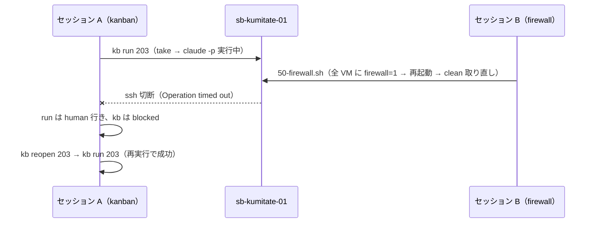

# 複数セッションで作業する

人間と複数の AI セッションが、同じリポジトリや Proxmox 環境で同時に作業するときのルールを説明します。実際に起きた衝突と復旧例をもとに、他の作業を妨げずに進める方法をまとめています。

## 前提

このリポジトリは、人間（メンテナ）と複数の AI セッションが交代で、ときに同時に作業する前提で書かれています。ルート README の「このリポジトリを読む AI へ」が入口で、次の順で作業状況を確認します。

1. README で全体像（4 区画）を掴む
2. 着手する区画の `README.md` で設計と契約を読む
3. その区画の `STATUS.md` で進捗票と実機確認コマンドを見て、書かれている進捗と実機が一致するか確かめる
4. 一致していれば次の未完了ステップから。一致していなければ、先に `STATUS.md` を実機に合わせて直す
5. 判断を変えたら `docs/adr/` に 1 枚追加する（既存 ADR を書き換えない）

**実機が正**。ドキュメントと実機が食い違ったら実機を信じ、ドキュメントを直します。

## 同時作業の約束

kanban を作るセッションと sandbox の通信制限を作るセッションが同時に走り、実際に衝突したことがあります（2026-09-06）。そこから決めた約束です。

| 約束 | 理由 |
|---|---|
| ADR を足す前に `ls docs/adr/` で最大番号を取り直す | 会話の冒頭で見た番号を信じて、同じ番号（0010）を 2 つ作った |
| `git status` に自分が触っていない変更があっても戻さない。別セッションの作業として扱い、コミットは自分の分に絞る | 相手の作業ツリーを壊さない |
| 貸出中の VM（`sandbox ls` で TASK が付いているもの、`~/.config/sandbox/state.json`）を再起動・巻き戻し・作り替えしない。全 VM を触る作業は直前に貸出状態を読んで飛ばす | ファイアウォール作業で全 VM を再起動し、走っていた run が ssh 切断で落ちた |
| チケットの状態は `kb` で更新する。runner を直接呼んだときも `kb sync <id> --run <dir>` で追従させる | 別経路でマージされた PR の出どころが分からなくなった |
| PR の状態や run の結果は GitHub / `state.json` を再確認してから台帳に書く | 相手のコミットで初めて見える記録がある |

## 衝突の例と復旧

復旧は `kb reopen` → `kb run` です。runner は同じ日の再実行で前回の `runs/` を `-attemptN` に退避するので、失敗の記録は残ります。

## 役割を分けるなら

同時に動かすなら、触る範囲を分けるのが安全です。

| 範囲 | 触るもの | 触らないもの |
|---|---|---|
| チケットを実行する係 | `workspace/kanban/`、`workspace/runs/`、`glue/` | Proxmox、テンプレート、ファイアウォール |
| sandbox を育てる係 | `sandbox/proxmox/`、テンプレート、ファイアウォール | 貸出中の VM |
| 定義を育てる係 | `workflow/kit/`、`workspace/projects/<pj>/project.yml` | 実行中の run（変更は次の run から効く） |

## コミット

- 自分の変更だけを `git add` で選ぶ。`git add -A` は使わない（相手の作業を拾う）
- 相手が自分の変更もまとめてコミットしていることがある。`git log --stat` で確かめてから、残りだけをコミットする
- 実行記録（`workspace/runs/`）と台帳（`workspace/kanban/kanban.db`）は workspace にあり、リポジトリでは追跡しない。単一 Mac 前提で、複数マシンから同じ DB を書かない
