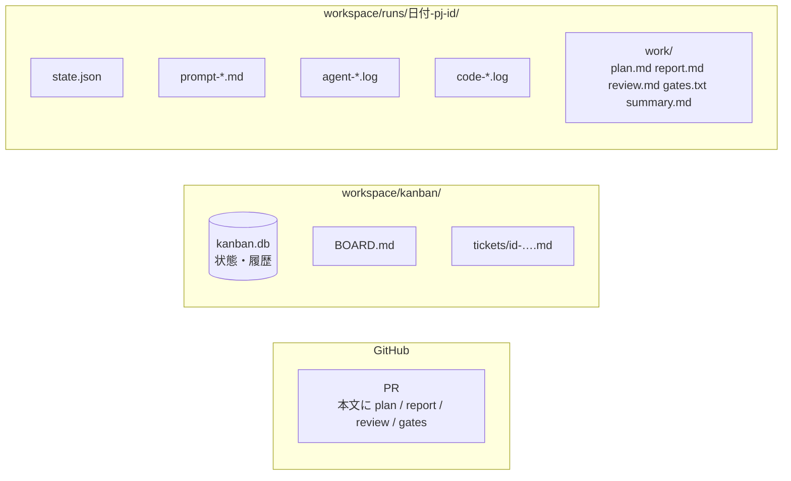
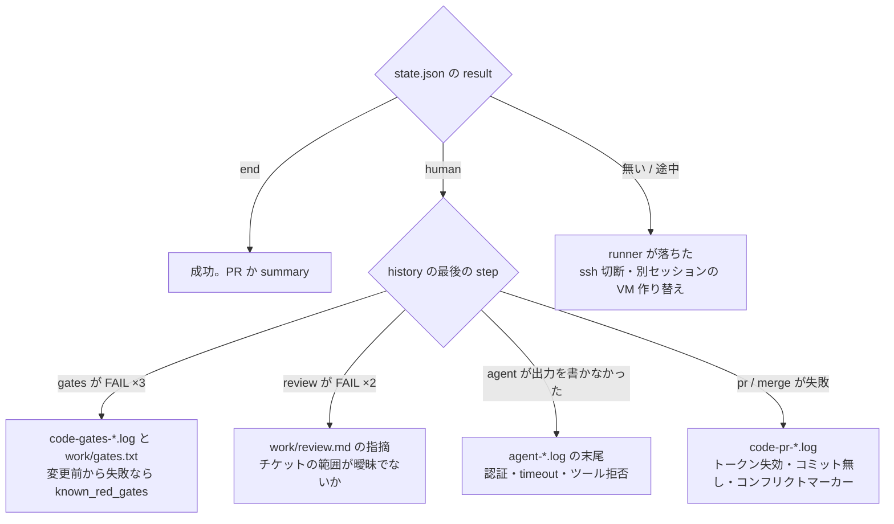

# 結果を読む

実行後に残る PR、ログ、成果物の確認方法を説明します。まずチケットの状態を確認し、成功していれば PR や成果物を、途中で止まっていれば理由とログを読んでください。

## 保存先の一覧



## まず見るもの

```bash
kanban/bin/kb show 204          # 状態・PR 番号・run ディレクトリ・メモ
kanban/bin/kb history 204       # 状態遷移の履歴（いつ誰が何を）
cat workspace/kanban/BOARD.md   # 全体のボード（workspace は $AIFACTORY_WORKSPACE）
```

`status` が `review` なら PR を読む番です。`blocked` ならメモに理由（人間へ / runner 異常終了 / project.yml なし）があります。

ブラウザで見るなら [Web コンソール](console.md)。ボードから run の工程トラック（工程ごとの合否と所要）とログ、成果物までたどれます。

## PR の読み方

PR の本文は `kit/steps/pr-create.sh` が組み立てます。内容は次の順に並びます。

1. 「aifactory sandbox による自動作業。ワークフロー: bug。マージは人間が判断する」の定型
2. `plan.md`（planner の計画: 範囲、検証方法、リスク）
3. `report.md`（implementer の報告: 何をした、テストの結果、範囲外の発見）
4. `review.md`（reviewer の判定: PASS / FAIL と根拠、人間向けメモ）
5. `gates.txt`（ゲートの結果: `PASS typecheck` / `FAIL test (~/gates/test.log)`）

まず `review.md` に挙がっている懸念を確認してください。reviewer は、変更範囲、正しさ、安全性、プロジェクト固有の確認事項、検証結果の順にレビューし、その結果を記録します。依頼の範囲外で見つかった懸念は「人間向けメモ」に分けて記載されます。

## 成果物（work/）

| ファイル | 誰が書く | 内容 |
|---|---|---|
| `plan.md` | planner | 再現条件、原因の仮説、変更範囲（ファイル単位）、検証方法、リスク。危険なら先頭に `STOP` |
| `research.md` | researcher | 結論（3 行）、項目ごとの所見（出典つき）、不明点、planner への申し送り |
| `report.md` | implementer | 何を変えたか、実行したテストと結果、範囲外の発見、判断に迷った点 |
| `review.md` | reviewer | PASS / FAIL、根拠、直すべき点、人間向けメモ |
| `gates.txt` | gates.sh | ゲートごとの PASS / FAIL / INFO とログの場所 |
| `summary.md` | judge（research ワークフロー） | 調査の結論と次にやるべきこと |

## 失敗の切り分け



| 症状 | 読む場所 | よくある原因 |
|---|---|---|
| gates が失敗して `human` | `code-gates-<n>.log`、VM 内 `~/gates/<name>.log`（回収後は `work/`） | 変更前のブランチでも失敗（`known_red_gates` に書く）、環境依存のテスト、依存の未インストール |
| review が FAIL | `work/review.md` | 範囲外の変更、テストを弱めて成功させた、migration の後方互換 |
| エージェントが成果物を書かず工程失敗 | `agent-<step>-<n>.log` の末尾 | トークン失効、`timeout_min` 超過、依頼文の出力先指定を見落とし |
| `pr-create.sh` が「コミットがない」 | `code-pr-<n>.log` | implementer がコミットしなかった。`report.md` に理由があるはず |
| merge が失敗 | `code-merge-<n>.log` | GitHub App トークンの失効（1 時間）、コンフリクトマーカー残り、base 未取り込み |
| ssh timeout で途中終了 | ターミナル出力 | 別セッションが VM を再起動した。`kb reopen` → `kb run` |

## 依頼文を読む

エージェントにどのような指示が渡されたかは、`prompt-<step>-<n>.md` で確認できます。8 層（共通の約束 → 役割ごとの行動ルール → 工程の brief → プロジェクトの事実・禁止・観点 → チケット → 入力成果物 → 前回の結果 → 出力先）で組み立てられているので、足りない事実や誤った禁止事項があればそこで見つかります。修正するファイルは [設定ファイルと優先順位](../concepts/configuration.md) で確認してください。

## 記録を残す

実行記録（`workspace/runs/`）と台帳（`workspace/kanban/`）はリポジトリの外（workspace）にあり、git には入りません。残したいなら workspace ごとバックアップするか、workspace を別の（private な）リポジトリにします。ログには秘密情報が出ないよう、エージェントは「秘密をログに出さない」約束で動き、`sandbox` CLI はトークンをマスク表示しますが、workspace を共有する前には `agent-*.log` に実値が混ざっていないかを確かめてください。
