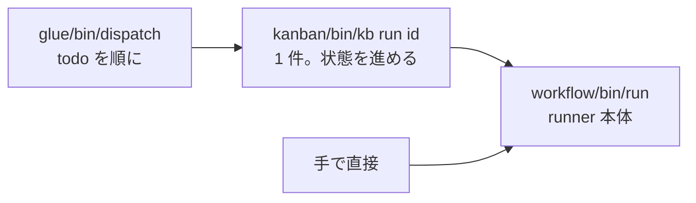

# 実行する

チケットを 1 件ずつ実行する方法、複数件を順に実行する方法、runner を直接呼び出す方法を説明します。実行前の確認、実行中のログの見方、停止と再開の手順もまとめています。

## 3 つの実行方法



| 入口 | 使いどころ | 状態の更新 |
|---|---|---|
| `glue/bin/dispatch` | todo を順に無人で回す。日常はこれ | kb 経由で自動 |
| `kanban/bin/kb run <id>` | 1 件だけ実行する。dry-run で定義を確かめる | 自動 |
| `workflow/bin/run …` | kanban を通さない実験。ワークフロー定義の開発 | されない。後で `kb sync` |

## dispatch でまとめて実行する

```bash
glue/bin/dispatch --once                 # 最も古い todo を 1 件
glue/bin/dispatch --max 3                # 3 件まで
glue/bin/dispatch --pj kumitate          # PJ を絞る
glue/bin/dispatch --dry-run              # VM を触らず、依頼文の組み立てだけ
glue/bin/dispatch --wait 60              # プールが満杯でも飛ばさず、空くまで最大 60 分待つ
```

dispatch は、チケットに登録されたプロジェクトと種別を使って実行します。実行前に確認する条件は、次の 2 つです。

- そのプロジェクトに `project.yml`（`$AIFACTORY_WORKSPACE/projects/<pj>/`、なければ `examples/projects/<pj>/`）が**ない** → `blocked` にして次へ（メモに理由を書く）
- そのプロジェクトのプール（3 台）が**全部貸出中** → そのプロジェクトは飛ばして次のプロジェクトの todo へ

`--wait` を付けると 2 つ目の確認をやめ、`kb run --wait <分>` で空くまで待たせます。プールより多い件数をまとめて流したいとき、人が終了を見張って次を手で起動しなくてよくなります。

チケットは 1 件ずつ順に処理します。たとえば検証に 60 分かかるチケットがあれば、それが終わるまで次のチケットは実行されません。

## kb run で 1 件実行する

```bash
kanban/bin/kb run 204                    # kind と同じ workflow で
kanban/bin/kb run 204 --workflow chore   # 今回だけ別の workflow で回す（kind は変わらない）
kanban/bin/kb run 204 --dry-run          # 定義と依頼文の確認だけ
kanban/bin/kb run 204 --keep             # 終わっても VM を返さない（中を見たいとき）
kanban/bin/kb run 204 --resume           # 貸出中の VM で、state.json の次の step から続ける
kanban/bin/kb run 204 --from             # 人間待ちで終わった run を、新しい VM で続きから（下）
kanban/bin/kb run 204 --wait             # プールに空きがなければ、空くまで待つ（既定 60 分。`--wait 30` で 30 分）
```

`kb run` は状態を `in_progress` にして runner を呼び、終わったら `state.json` を読んで状態を進めます。

| runner の結果 | kb の状態 | メモ |
|---|---|---|
| `state.json` に `merged` | `done` | runner が条件を確かめて自動マージした（ADR-0042） |
| `pr_url` に MERGED | `done` | マージ済み |
| `pr_url` あり | `review` | 人間がレビューしてマージ |
| PR なしで `end`（research など） | `done` | PR なしで終了 |
| `human` で PR なし | `blocked` | 人間へ。成果は `origin/sandbox/<id>-<wf>-wip` に退避 |
| runner が異常終了 | `blocked` | rc と次の工程 |
| `--wait` の上限まで待っても空きなし | `todo` | 直す所はないので未着手に戻す。空いたらまた回せる（ADR-0031） |

`--wait` で待っている間、チケットは `in_progress` のままで、コンソールのボードと実行記録には「VM の空き待ち」と経過時間が出ます。

プロジェクトの `project.yml` に [`auto_merge`](../reference/project-yml.md) を書くと、`pr` の後に `automerge` 工程が入ります。ゲートが緑・レビューが PASS・CI がすべて pass・GitHub の判定が `MERGEABLE` のときだけ runner が PR を `base_branch` へマージし、チケットは `done` になります。1 つでも欠けるときはマージせず、PR を開いたまま人間に渡します（理由はメモとコンソールに 1 行残ります）。書いていないプロジェクトの動きは今までどおりで、PR を作って人間の判断を待ちます。

チケットに[添付](tickets.md)があれば、runner が VM の `~/work/<id>/attachments/` に置き、各工程の依頼文に添付の案内（名前の一覧と「画像・PDF は Read で開いて見ること」）を 1 行足します。添付は実行記録の `work/attachments/` にも控えが残ります。添付が無ければ依頼文は変わりません。今のところ Proxmox backend だけの機能です（ADR-0041）。

## 実行中に見えるもの

ターミナルには `[run <pj>/<id> <経過秒>] <step>: PASS/FAIL → <次>` が工程ごとに出ます。同時に `$AIFACTORY_WORKSPACE/runs/<日付>-<pj>-<id>/`（既定 `workspace/runs/`）にファイルが増えていきます。

| ファイル | いつ | 何 |
|---|---|---|
| `ticket.md` | 開始時 | 渡したチケット |
| `state.json` | 工程ごと | 今どこか、ループ回数、結果 |
| `prompt-<step>-<n>.md` | エージェントが担当する工程の直前 | 組み立てた依頼文（8 層） |
| `agent-<step>-<n>.log` | エージェントの実行中（逐次） | `claude -p` のイベントを人が読める形にしたもの（時刻、ツール呼び出し ▶、結果の先頭 ↳、最後に result と費用） |
| `agent-<step>-<n>.jsonl` | エージェントの実行中（逐次） | 同じイベントの生 JSON（デバッグ用） |
| `code-<step>-<n>.log` | スクリプトの実行中（逐次） | gates / pr の出力 |
| `work/` | release 時 | VM から回収した成果物（チケットの添付は `work/attachments/`） |

`state.json` の `current` に今動いている工程とログ名が入るので、ログは工程の途中でも `tail -f` で追えます。ブラウザなら [Web コンソール](console.md) の run 画面が同じログを自動で開きます。

別のターミナルから VM の中を見ることもできます。

```bash
sandbox ls                                   # どの VM が貸出中か
sandbox ssh 204                              # 中に入る（dev ユーザー）
sandbox ssh 204 'cd $SANDBOX_APP_DIR && git log --oneline -5'
sandbox url 204                              # アプリの URL（ブラウザで開ける）
```

## 止める・やり直す

- **止める**: runner のプロセスを Ctrl-C。VM は貸出中のまま残るので、`sandbox release <id>` で返すか、`--resume` で続けます
- **base が赤くて `gates` で止まった**: 人が base（`develop` / `main`）を直してから、VM が貸出中のままなら `kb run <id> --resume`、返却済みなら `kb run <id> --from gates` で **gates から**続けられます。実装はやり直しません。`--resume` の再開位置は `state.json` の工程履歴から決まり、履歴が空（準備で落ちて 1 工程も終えていない）なら workflow の先頭工程から回ります（ADR-0047）
- **VM 起因で落ちた**（ssh 切断、トークン失効など）: `kb reopen <id>` → `kb run <id>`。同じ日の再実行は前回の `runs/` を `-attemptN` に退避してから作ります
- **エージェントの出力が悪くて `human` 行き**: `work/` と `agent-*.log` を読んでチケットを直し、`kb reopen` → `kb run`。成果を残したければ `origin/sandbox/<id>-<wf>-wip` にあります。指摘が軽ければ、最初からやり直さず `kb run <id> --from` で続きから回せます（下）
- **定義を変えた**（project.yml / ワークフローの YAML / roles）: 実行中の run には効きません。次の run から

### 止まった run を続きから回す（`--from`）

人間待ちで終わった run は、**新しい VM で、その run の続きから**やり直せます。調査と設計は走りません。

```bash
kb run 204 --from                                   # 記録に残った工程から（既定）
kb run 204 --from implement                         # 工程を指定して
kb run 204 --from implement --branch sandbox/204-feature-wip   # 続きに使うブランチも指定して
```

打つべき 1 行は、チケットのメモ・コンソールの run 画面の「結果」・`ticket_show` の実行記録にそのまま出ます。

- 続きは記録の `wip_branch`（人間待ちのときに runner が退避したブランチ）から始まります。`--branch` はその上書きです
- 前回の `work/plan.md` などは新しい VM に持ち込み、前回の `review.md` は最初の依頼文に「前回の結果（直すこと）」として入ります
- 前回の run はそのまま残り、新しい run の `state.json` に `resumed_from` が入ります。戻せる回数（`loops`）は数え直しです
- `--resume`（貸出中の**同じ** VM で続ける）とは別物で、併用はできません
- 同じチケットを 2 つ同時に再開しないでください（退避ブランチの名前がチケットと workflow で決まるため、後から終わった方が上書きします）

## runner を直接呼ぶ

```bash
workflow/bin/run <pj> <task-id> <workflow> <ticket.md> [--dry-run] [--keep] [--resume] [--from[=step]] [--branch=名前]
workflow/bin/run kumitate 900 hotfix ticket.md --dry-run
```

kanban を通さないので状態は変わりません。終わったら `kb sync <id> --run <run ディレクトリ名>`（例: `2026-09-06-kumitate-206`）で追従させてください。task-id を手で振ると kanban の採番と衝突するので、実験以外では使いません。
