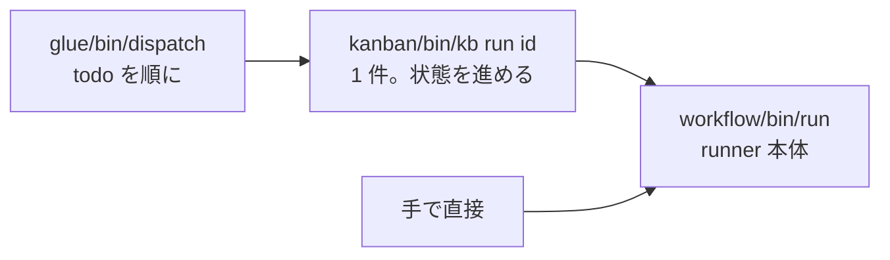

# 実行する

このページで分かること: チケットを回す 3 つの方法（`kb run` / `dispatch` / runner 直呼び）、dry-run、実行中に見えるもの、止め方と再開。

## 3 つの入口



| 入口 | 使いどころ | 状態の更新 |
|---|---|---|
| `glue/bin/dispatch` | todo を順に無人で回す。日常はこれ | kb 経由で自動 |
| `kanban/bin/kb run <id>` | 1 件だけ回す。dry-run で定義を確かめる | 自動 |
| `workflow/bin/run …` | kanban を通さない実験。workflow 定義の開発 | されない。後で `kb sync` |

## dispatch でまとめて回す

```bash
glue/bin/dispatch --once                 # 最も古い todo を 1 件
glue/bin/dispatch --max 3                # 3 件まで
glue/bin/dispatch --pj kumitate          # PJ を絞る
glue/bin/dispatch --dry-run              # VM を触らず、依頼文の組み立てだけ
```

dispatch は判断をしません。見るのは 2 つだけです。

- その PJ に `project.yml`（`$AIFACTORY_WORKSPACE/projects/<pj>/`、無ければ `examples/projects/<pj>/`）が**無い** → `blocked` にして次へ（メモに理由を書く）
- その PJ のプール（3 台）が**全部貸出中** → その PJ は飛ばして次の PJ の todo へ

直列です。1 件終わるまで次は始めません。ゲートが 60 分かかる run があると他は待ちます。

## kb run で 1 件回す

```bash
kanban/bin/kb run 204                    # kind と同じ workflow で
kanban/bin/kb run 204 --workflow chore   # workflow を変える（kind も書き換わる）
kanban/bin/kb run 204 --dry-run          # 定義と依頼文の確認だけ
kanban/bin/kb run 204 --keep             # 終わっても VM を返さない（中を見たいとき）
kanban/bin/kb run 204 --resume           # 貸出中の VM で、state.json の次の step から続ける
```

`kb run` は状態を `in_progress` にして runner を呼び、終わったら `state.json` を読んで状態を進めます。

| runner の結果 | kb の状態 | メモ |
|---|---|---|
| `pr_url` に MERGED | `done` | マージ済み |
| `pr_url` あり | `review` | 人間がレビューしてマージ |
| PR 無しで `end`（research など） | `done` | PR 無しで終了 |
| `human` で PR 無し | `blocked` | 人間へ。成果は `origin/sandbox/<id>-<wf>-wip` に退避 |
| runner が異常終了 | `blocked` | rc と次の step |

## 実行中に見えるもの

ターミナルには `[run <pj>/<id> <経過秒>] <step>: PASS/FAIL → <次>` が step ごとに出ます。同時に `$AIFACTORY_WORKSPACE/runs/<日付>-<pj>-<id>/`（既定 `workspace/runs/`）にファイルが増えていきます。

| ファイル | いつ | 何 |
|---|---|---|
| `ticket.md` | 開始時 | 渡したチケット |
| `state.json` | step ごと | 今どこか、ループ回数、結果 |
| `prompt-<step>-<n>.md` | agent step の直前 | 組み立てた依頼文（8 層） |
| `agent-<step>-<n>.log` | agent step 中（逐次） | `claude -p` のイベントを人が読める形にしたもの（時刻、ツール呼び出し ▶、結果の先頭 ↳、最後に result と費用） |
| `agent-<step>-<n>.jsonl` | agent step 中（逐次） | 同じイベントの生 JSON（デバッグ用） |
| `code-<step>-<n>.log` | code step 中（逐次） | gates / pr の出力 |
| `work/` | release 時 | VM から回収した成果物 |

`state.json` の `current` に今動いている step とログ名が入るので、ログは step の途中でも `tail -f` で追えます。ブラウザなら [Web コンソール](console.md) の run 画面が同じログを自動で開きます。

別のターミナルから VM の中を見ることもできます。

```bash
sandbox ls                                   # どの VM が貸出中か
sandbox ssh 204                              # 中に入る（dev ユーザー）
sandbox ssh 204 'cd $SANDBOX_APP_DIR && git log --oneline -5'
sandbox url 204                              # アプリの URL（ブラウザで開ける）
```

## 止める・やり直す

- **止める**: runner のプロセスを Ctrl-C。VM は貸出中のまま残るので、`sandbox release <id>` で返すか、`--resume` で続けます
- **VM 起因で落ちた**（ssh 切断、トークン失効など）: `kb reopen <id>` → `kb run <id>`。同じ日の再実行は前回の `runs/` を `-attemptN` に退避してから作ります
- **agent の出力が悪くて `human` 行き**: `work/` と `agent-*.log` を読んでチケットを直し、`kb reopen` → `kb run`。成果を残したければ `origin/sandbox/<id>-<wf>-wip` にあります
- **定義を変えた**（project.yml / workflow yml / roles）: 走っている run には効きません。次の run から

## runner を直接呼ぶ

```bash
workflow/bin/run <pj> <task-id> <workflow> <ticket.md> [--dry-run] [--keep] [--resume]
workflow/bin/run kumitate 900 hotfix ticket.md --dry-run
```

kanban を通さないので状態は変わりません。終わったら `kb sync <id> --run <run ディレクトリ名>`（例: `2026-09-06-kumitate-206`）で追従させてください。task-id を手で振ると kanban の採番と衝突するので、実験以外では使いません。
