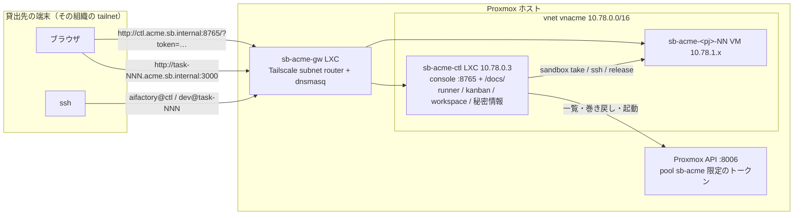

# 貸出先ごとの環境（テナント）と Proxmox 上の制御系

このページで分かること: 工場を **別の組織に貸し出す** ときの構成。組織ごとに網・VM・権限・秘密情報を分け、console / docs / runner まで Proxmox 上の LXC で完結させる（Mac 側には何も要らない）。判断の理由は [ADR-0017](../decisions/index.md)。

## 何が分かれるか

1 テナント = 1 貸出先 = 独立した sandbox 環境。`SB_TENANT`（`[a-z0-9]{1,6}`）で指定します。最初の環境も特別扱いせず slug `main` を持ちます。**命名規則: すべての名前に `sb` とテナント名を含める**（DNS は `<t>.sb.internal`、Proxmox の zone は `sb<t>`、vnet は `vn<t>`、VM とプールとグループは `sb-<t>-…`）。

| もの | `main`（最初の環境） | テナント `acme`（例） |
|---|---|---|
| SDN zone / vnet | `sbmain` / `vnmain` | `sbacme` / `vnacme` |
| 網（/16） | `10.77.0.0/16` | `SB_NET.0.0/16`（例 `10.78`。**テナントごとに変える**） |
| VMID 帯 | 9000〜 | `SB_VMID_BASE`〜（例 8000。**1000 刻みで変える**） |
| 名前 | `sb-main-gw` / `-ctl` / `-base` / `-tpl-<pj>` / `-<pj>-NN` | `sb-acme-gw` / `-ctl` / `-base` / `-tpl-<pj>` / `-<pj>-NN` |
| DNS | `*.main.sb.internal` | `*.acme.sb.internal` |
| firewall group | `sb-main` / `sb-main-ctl` | `sb-acme` / `sb-acme-ctl` |
| Proxmox のリソースプール / ユーザー | `sb-main` / `sb-main@pve` | `sb-acme` / `sb-acme@pve` |
| tailnet | メンテナの tailnet | **貸出先の tailnet**（gw の `tailscale up` をその組織のアカウントで） |

導出は `sandbox/proxmox/_tenant.sh` に 1 つ。個別に上書きしたいときは `SB_ZONE` / `SB_VNET` / `SB_PREFIX` / `SB_FW_GROUP` / `SB_POOL` / `SB_DOMAIN` を与えます。

## 1 テナントの中身



- **制御系 LXC `sb-acme-ctl`**: aifactory の checkout、workspace、`sandbox` CLI、Web コンソール、ドキュメントサイト（`/docs/`）、GitHub App トークン更新の timer、runner が使う python3 / gh / claude / ssh。systemd で常駐します。LAN 側に足は無く、外向きはホストの SNAT、到達は gw の subnet router 経由だけ
- **Proxmox への権限**: 制御系の `sandbox` CLI は **API モード**（`PVE_API_TOKEN`）で動き、自分のプールの VM を「一覧する・起動する・`clean` に巻き戻す」だけができます。ホストの root は持ちません
- **隔離は 3 層**: 網（別 vnet。VM も制御系も RFC1918 全体と tailnet 宛てを DROP するので、他テナントの網には出られない）、権限（API トークンがプール限定）、秘密情報（制御系の中だけ）

## 作る（メンテナ = ホスト管理者）

手元（Mac）に `~/.config/sandbox/tenants/acme.env` を置きます。

```bash
PVE_HOST=pve1          # Proxmox ホストの ssh エイリアス
SB_NET=10.78           # テナント専用の /16
SB_VMID_BASE=8000      # テナント専用の VMID 帯
```

あとは [sandbox の構築](../getting-started/build-sandbox.md) の手順を、すべて `SB_TENANT=acme` を付けて実行します。増えるのは 2 ステップだけです。

```bash
SB_TENANT=acme sandbox/proxmox/run.sh 05-tenant.sh          # Step 0c: プール・ロール・ユーザー・ACL
SB_TENANT=acme sandbox/proxmox/run.sh 10-sdn.sh             # Step 1
SB_TENANT=acme sandbox/proxmox/run.sh 20-gateway-lxc.sh     # Step 2a
SB_TENANT=acme sandbox/proxmox/run.sh 25-control-lxc.sh     # Step 2d: 制御系 LXC（API トークンを発行して中に書く）
#   Step 2b: 貸出先が自分の Tailscale アカウントで gw を up し、route 承認・ACL・split DNS（acme.sb.internal → gw）を行う
SB_TENANT=acme sandbox/proxmox/run.sh 30-base-template.sh create   # Step 3〜5c は従来どおり（制御系の鍵込みで焼かれる）
…
SB_TENANT=acme sandbox/proxmox/run.sh 50-firewall.sh
```

`25-control-lxc.sh` は再実行できます（API トークンを作り直して書き直す）。制御系の ssh 鍵は `run.sh` が拾って以後のテンプレートと gw に入れるので、**制御系は base テンプレートより先に**作ります。

## 渡す（貸出先へ）

| 渡すもの | どこにあるか |
|---|---|
| 制御系 LXC への ssh | 貸出先の公開鍵を `sb-acme-ctl` の `/home/aifactory/.ssh/authorized_keys` に足す |
| コンソールの合言葉（任意） | 制御系は内側の網（`10.x`）にしか出ていないので、既定では合言葉なしで開けます（ADR-0021）。かけたいときは LXC の `~/.config/aifactory/ctl.env` に `CONSOLE_TOKEN=<合言葉>` を置き `sudo systemctl restart aifactory-console` |
| URL | `http://ctl.acme.sb.internal:8765/`（合言葉をかけたときは `/?token=<合言葉>` で 1 回入ると cookie に残る）、docs は `/docs/` |

渡さないもの: ホストの root、他テナントの何か、メンテナのトークン。

## 使う（貸出先）

秘密情報は自分で制御系の中に入れます。メンテナは持ちません。

```bash
ssh aifactory@ctl.acme.sb.internal
sandbox token set <pj>                      # Claude Code の長期トークン（claude setup-token の出力）
~/aifactory/sandbox/bin/gh-app-setup        # GitHub App（ブラウザ操作は手元で。作った app.env と private-key.pem を ~/.config/sandbox/gh-app/ に）
vi ~/.config/aifactory/ctl.env              # CLAUDE_CODE_OAUTH_TOKEN（intake が制御系で 1 回 LLM を呼ぶ）。GH_TOKEN は App があれば空でよい
sudo systemctl restart aifactory-console
```

以後は [チケットを作る](tickets.md) → [実行する](running.md) → [結果を読む](results.md) と同じです。PJ 定義は `~/workspace/projects/<pj>/` に置きます（[プロジェクトを追加する](add-project.md)）。

## 運用の要点

- コードの更新（LXC の中）: `cd ~/aifactory && git pull && sandbox/bin/install.sh && (cd website && .venv/bin/mkdocs build -q) && sudo systemctl restart aifactory-console`
- API トークンの作り直し: メンテナが `SB_TENANT=acme sandbox/proxmox/run.sh 25-control-lxc.sh`
- `sandbox ls` が `Proxmox API … が失敗`: LXC から `curl --cacert ~/.config/sandbox/pve-ca.pem --resolve <node>:8006:10.78.0.1 https://<node>:8006/api2/json/version` が通るか（証明書の SAN はノード名なので `PVE_API_RESOLVE` で SDN 側の IP に向けている）、firewall group `sb-acme-ctl` の OUT が自テナントの /16 を許可しているか
- 未決（ADR-0017）: テナントの片付け手順の自動化、テナント別の RAM / ディスク上限、制御系の自動更新
