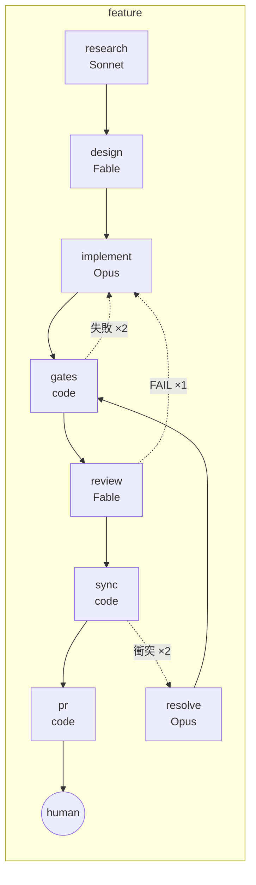
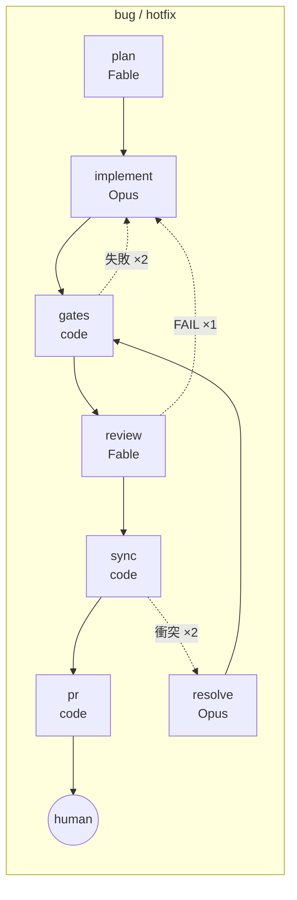
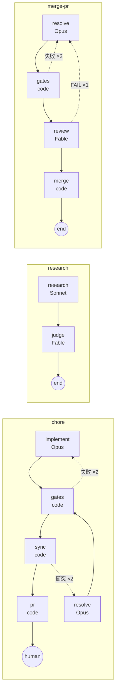
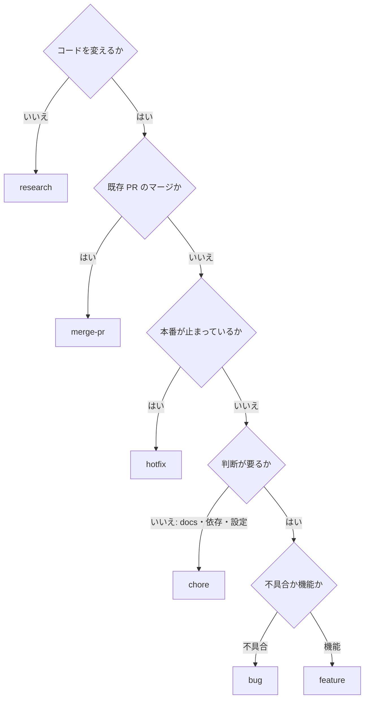

# ワークフローの選び方

ワークフローは、チケットを処理するための手順です。用意されている 6 種類について、用途、工程の流れ、担当する役割とモデル、修正をやり直す回数の上限を説明します。

## 一覧

| ワークフロー | 流れ | 使いどころ | 出口 |
|---|---|---|---|
| **hotfix** | plan → implement → gates → review → sync → pr | 本番障害の最小修正。宛先は `hotfix_base`（通常 `main`） | PR → 人間 |
| **bug** | plan → implement（再現テスト先行）→ gates → review → sync → pr | 不具合修正 | PR → 人間 |
| **feature** | research → design → implement → gates → review → sync → pr | 機能追加。調査と設計を挟む | PR → 人間 |
| **chore** | implement → gates → sync → pr | ドキュメントの修正、依存関係の更新、設定変更など、方針が明確な作業。計画とエージェントによるレビューは省略 | PR → 人間 |
| **research** | research → judge → end | 調べるだけ。コードは変えない。`summary.md` を回収 | 完了（PR なし） |
| **merge-pr** | resolve → gates → review → merge | 既存 PR のコンフリクト解消とマージ。本文の `pr: N` で対象を指定 | マージ済み |

## 流れの図

青い箱はエージェントが担当する工程（VM 内で `claude -p`）、`code` がスクリプトが担当する工程（制御系のスクリプトが必要に応じて VM に接続して実行）。点線は差し戻しで、上限を超えると `human` に抜けます。

`sync` は PR を作る直前に base の最新を取り込む工程です（runner 内蔵。ADR-0031）。並列に走った別の run の PR が先にマージされても、後発の PR が CONFLICTING で出てこないようにします。衝突したら人間ではなく implementer（`resolve`）に戻して解消させ、2 回解消できなかったときだけ `human` に抜けます。

## 選び方の目安

intake はこの目安で判定します。迷ったら **bug**（計画とレビューがある）を選ぶのが安全で、chore は「間違えても影響が小さいもの」に限ります。

## 役割とモデル

| 役割 | クラス | モデル（`routes.env`） | 出力 |
|---|---|---|---|
| planner | judgment | Fable 5.1 | `plan.md` |
| researcher | research | Sonnet 5 | `research.md` / `summary.md` |
| implementer | coding | Opus 5 | git コミット + `report.md` |
| reviewer | judgment | Fable 5.1 | `review.md` |

工程ごとのモデルの種類は `model_class` で変更できます。今回の実行だけモデルを変えたい場合は、環境変数 `CLAUDE_MODEL` を指定してください。

## 実績と時間の目安

メンテナの環境での実測（2026-09）です。

| run | ワークフロー | エージェント | ゲート | 結果 |
|---|---|---|---|---|
| Node monorepo の依存更新（差分 3 行） | bug 相当 | 455 秒 | 6 分 | PR |
| Next.js の時間依存テストの修正（kumitate） | bug 相当 | 582 秒 | 16 分 | PR、6 ゲートすべて成功 |
| Node プロジェクトの CI ゲートの調査 | research | 232 秒 | なし | summary.md |
| Rails + MySQL プロジェクトの既存 PR のマージ | merge-pr | 解消 16 分 + レビュー 2 分 | 57 分 | マージ済み |
| kumitate の CI の調査 | research | 433 秒 | なし | summary.md |

時間の大半はゲートです。エージェントは数分で終わります。

## 自分でワークフローを足す

`workflow/kit/workflows/<name>.yml` を 1 枚足せば、`kb new` の `kind` として使えるようになります。形は [ワークフローの YAML](../reference/workflow-yml.md)。工程の担い手は既存の 4 役割かスクリプトが担当する工程（`gates.sh` / `pr-create.sh` / `pr-merge.sh` と、runner 内蔵の `sync-base`）で、新しい役割が要るなら `workflow/kit/roles/<role>.md` を足します。
