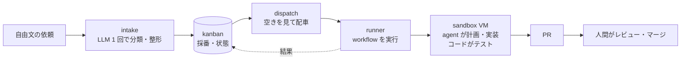

# aifactory

**チケットを入れると、隔離された VM の中でエージェントが計画・実装し、コードがテストを回し、人間は最後にレビューだけする**。そういう「ソフトウェアファクトリー」を自前で組むためのリポジトリです。

このサイトは、リポジトリを初めて見た人が「何なのか」「どう入れるか」「どう使うか」「中で何が起きているか」を順に読めるように書いてあります。正本はリポジトリ内の README / ADR / STATUS で、このサイトはそれを読み下したものです。

## 何ができるか

- 「kumitate の calendar テストが月替わりで落ちる。直して」のような**自由文**を 1 コマンドでチケットにする
- チケットは PJ ごとの **隔離 VM**（Proxmox 上、1 タスク 1 台、終わると初期状態に巻き戻る）で処理される
- VM の中で **agent**（Claude Code）が計画・実装・レビューし、**コード**がテスト（lint / typecheck / test）を回して赤なら差し戻す
- 結果は **PR** になり、人間がレビューしてマージする。マージ作業そのものも workflow で無人化できる
- 状態（todo → 実行中 → レビュー待ち → 完了）と記録（依頼文、ログ、成果物）はすべてファイルに残る
- ブラウザの **Web コンソール**（`console/bin/console`）で、ボード・実行中の run のログ・VM の貸出を 1 画面で見て、同じ操作をボタンで行える。AI セッションからは **MCP**（`console/bin/mcp`）で同じ読み書きができる

## 3 つのアクター

着想は Dan Isler（IndieDevDan）の講演動画 "FORGET Loop Engineering. Agentic Engineering is about THIS"。要点は、価値を生む 3 つのアクターを分けて使うことです。

| アクター | 特性 | この工場での担当 |
|---|---|---|
| **コード** | 速い・毎回同じ・トークン 0 円・最も信頼できる | 採番、配車、VM の貸出、ゲート（lint / test）、PR 作成、マージ、状態の記録 |
| **エージェント** | 柔軟だが遅く高くブレる | 計画（planner）、実装（implementer）、調査（researcher）、レビュー（reviewer） |
| **エンジニア（人間）** | 最も高価 | 冒頭の依頼と、末尾の PR レビュー・マージ判断だけ |

設計原則は「**コードとエージェントを分離する**」。エージェントに lint を走らせるのではなく、コードが lint を走らせて結果をエージェントに戻します。

## 4 つの区画

| 区画 | 問い | 実体 | 既定の構成 |
|---|---|---|---|
| [sandbox](concepts/sandbox-internals.md) | どこで動くか | Proxmox VM のプール + Mac 側 CLI | PJ ごと 3 台 + 汎用 3 台 |
| [kanban](reference/cli-kb.md) | 何をいつやるか | SQLite + `kb` CLI | 5 状態、連番 ID |
| [workflow](concepts/workflow-engine.md) | どう進めるか | YAML 定義 + Python runner | 6 workflow（hotfix / bug / feature / chore / research / merge-pr） |
| [glue](reference/cli-glue.md) | 区画をつなぐ | `intake`（取り込み）+ `dispatch`（配車） | LLM は intake の 1 回だけ |

## どこから読むか

- :material-rocket-launch: **[はじめに](getting-started/index.md)**

    前提、Mac 側のセットアップ、sandbox の構築、最初の 1 周。

- :material-book-open-variant: **[使い方](guides/index.md)**

    チケットの作り方、実行、結果の読み方、PJ の追加、日々の運用。

- :material-cog: **[仕組み](concepts/index.md)**

    全体の構成、チケットの一生、workflow エンジン、LLM の居場所、設定の出どころ。

- :material-file-document: **[リファレンス](reference/index.md)**

    CLI の全コマンド、`project.yml`、workflow yml、役割とモデル、用語集。

!!! note "前提"
    この工場は Proxmox VE（VM プール）、Tailscale（Mac から VM への経路）、GitHub App（push / PR の権限）、Claude Code（agent）を前提に作られています。運用データ（PJ 定義、チケット、実行記録、ログ）はリポジトリ外の **workspace**（`AIFACTORY_WORKSPACE`、既定 `<repo>/workspace/`）に置き、リポジトリには工場の仕組みだけが入っています。自分の環境で動かすには [前提と準備するもの](getting-started/requirements.md) から読んでください。同梱の PJ 定義の例は `examples/projects/kumitate/`（[akkijp/kumitate](https://github.com/akkijp/kumitate)）です。ライセンスは Apache-2.0。
