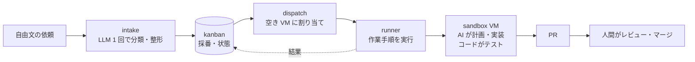

# aifactory

**aifactory は、依頼をチケットとして登録すると、AI エージェントが計画・実装を進め、テストを経てプルリクエスト（PR）を作成する開発の仕組みです。** エージェントは隔離された仮想マシン（VM）で作業し、人間が最後に PR をレビューして、マージするかどうかを判断します。

このリポジトリには、こうした開発環境を自分で構築・運用するためのツールと手順がそろっています。

このサイトでは、初めて使う人に向けて、概要、導入手順、使い方、内部の仕組みを順に説明します。設計や構築状況の基準となる情報は、リポジトリ内の README、ADR、STATUS に記録されています。

## 何ができるか

- 「kumitate の calendar テストが月替わりで落ちる。直して」のような**自由文**を 1 コマンドでチケットにする
- **タスクごとに VM を 1 台割り当てる**。プロジェクトごとに用意した隔離 VM で作業し、終了後は初期状態に戻す
- VM の中で **エージェント**（Claude Code）が計画・実装・レビューし、**コード**がテスト（lint / typecheck / test）を回して失敗したら差し戻す
- 結果は **PR** になり、人間がレビューしてマージする。マージ作業そのものもワークフローで無人化できる
- 状態（todo → 実行中 → レビュー待ち → 完了）と記録（依頼文、ログ、成果物）はすべてファイルに残る
- ブラウザの **Web コンソール**（`console/bin/console`）で、ボード・実行中の run のログ・VM の貸出を 1 画面で見て、同じ操作をボタンで行える。AI セッションからは **MCP**（`console/bin/mcp`）で同じ読み書きができる

## コード・エージェント・人間の役割

着想は Dan Isler（IndieDevDan）の講演動画 "FORGET Loop Engineering. Agentic Engineering is about THIS"。この構想では、コード、エージェント、人間が、それぞれの得意な作業を担当します。

| 担当 | 特性 | 主な作業 |
|---|---|---|
| **コード** | 定められた処理を実行する。LLM のトークンを消費しない | 採番、実行の割り当て、VM の貸出、ゲート（lint / test）、PR 作成、マージ、状態の記録 |
| **エージェント** | 状況に応じて判断できる。処理時間や費用がかかり、結果にばらつきがある | 計画（planner）、実装（implementer）、調査（researcher）、レビュー（reviewer） |
| **エンジニア（人間）** | 作業の目的を決め、最終的な判断を担う | 依頼の作成、PR のレビュー、マージの判断 |

設計の基本は、**判断を伴う作業をエージェントに、決まった手順で行う検証をコードに任せること**です。たとえば lint はスクリプトが実行し、失敗した場合はその結果をエージェントに渡して修正を求めます。

## 4 つの構成要素

このドキュメントでは、作業対象のリポジトリを「プロジェクト」（設定やコマンドでは `pj`）、1 回の実行を「run」と呼びます。テストや静的解析など、次の工程に進めるかを確認する検証を「ゲート」と呼びます。

| 構成要素 | 役割 | 実装 | 既定の構成 |
|---|---|---|---|
| [sandbox](concepts/sandbox-internals.md) | どこで動くか | Proxmox VM のプール + Mac 側 CLI | プロジェクトごと 3 台 + 汎用 3 台 |
| [kanban](reference/cli-kb.md) | 何をいつやるか | SQLite + `kb` CLI | 5 状態、連番 ID |
| [ワークフロー](concepts/workflow-engine.md) | どう進めるか | YAML 定義 + Python runner | 6 種類のワークフロー（hotfix / bug / feature / chore / research / merge-pr） |
| [glue](reference/cli-glue.md) | 区画をつなぐ | `intake`（取り込み）+ `dispatch`（実行の割り当て） | LLM は intake の 1 回だけ |

## 目的に合わせて読む

- :material-rocket-launch: **[はじめに](getting-started/index.md)**

    前提、Mac 側のセットアップ、sandbox の構築、最初のチケット実行。

- :material-book-open-variant: **[使い方](guides/index.md)**

    チケットの作り方、実行、結果の読み方、プロジェクトの追加、日々の運用。

- :material-cog: **[仕組み](concepts/index.md)**

    全体の構成、チケットの作成から完了まで、ワークフローエンジン、Claude Code の実行場所、設定ファイルと優先順位。

- :material-file-document: **[リファレンス](reference/index.md)**

    CLI の全コマンド、`project.yml`、ワークフローの YAML、役割とモデル、用語集。

!!! note "前提"
    aifactory は Proxmox VE（VM プール）、Tailscale（Mac から VM への経路）、GitHub App（push / PR の権限）、Claude Code（エージェント）を前提に作られています。運用データ（プロジェクト定義、チケット、実行記録、ログ）はリポジトリ外の **workspace**（`AIFACTORY_WORKSPACE`、既定 `<repo>/workspace/`）に置き、リポジトリには aifactory 本体のコードや共通設定が入っています。自分の環境で動かすには [前提と準備するもの](getting-started/requirements.md) から読んでください。同梱のプロジェクト定義の例は `examples/projects/kumitate/`（[akkijp/kumitate](https://github.com/akkijp/kumitate)）です。ライセンスは Apache-2.0。
