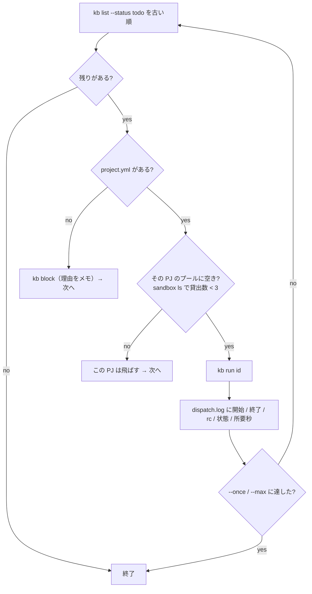

# intake / dispatch（glue）

`glue/bin/intake`（自由文 → チケット）と `glue/bin/dispatch`（todo → 実行）。どちらも Python 3。

## intake

```
intake <text-file|-> [--pj P] [--kind K] [--model M] [--dry-run]
```

| 引数 | 意味 |
|---|---|
| `text-file` | 自由文のファイル。`-` で標準入力 |
| `--pj` / `--kind` | 決定的に指定。LLM の判定より優先 |
| `--model` | 使うモデル。既定は `workflow/kit/routes.env` の `MODEL_judgment` |
| `--dry-run` | 起票せず、判定結果の JSON を出す |

### 動き

1. 入力の先頭 5 行から `pj:` / `kind:` 行を拾う（決定的）。本文からは取り除く
2. `--pj` / `--kind` があればそれを優先。指定値は実在検証する
3. Mac 上の一時ディレクトリを cwd に、ツール無しで `claude -p` を 1 回呼ぶ。渡すのは PJ 一覧（`project.yml` の display_name / repo / stack、無い PJ は「project.yml 無し」と明記）、種別一覧（workflow yml の description）、判定の目安、チケットの形、依頼文
4. 出力の JSON（`pj` / `kind` / `title` / `body` / `confidence` / `reason`）を取り出す。指定済みの pj / kind で上書き
5. 本文末尾に `（intake <日時> / model <モデル> / confidence <値> / <理由>）` を付けて `kb new`。本文冒頭に `pr: N` があれば `--pr` に回す
6. `workspace/logs/intake.log` に 1 行（日時 / id / pj / kind / confidence / モデル / 理由）

### 出力

`kb new` の出力（id と本文のパス）。`--dry-run` なら JSON。

```json
{
  "pj": "kumitate",
  "kind": "bug",
  "title": "fix: calendar の表題テストを固定日時にして時間依存を解消する",
  "body": "## 背景\n…\n## 完了条件\n- …",
  "confidence": 0.9,
  "reason": "kumitate の apps/web のテストの話。不具合修正なので bug"
}
```

### エラー

| メッセージ | 原因 |
|---|---|
| `入力が空` | ファイルが空 |
| `pj=… は […] のどれでもない` | 指定した PJ / 種別が存在しない |
| `claude -p が失敗` | Claude Code の認証、ネットワーク |
| `JSON が取れない` | LLM が JSON を出さなかった。出力の末尾を表示する |
| `kb new が失敗` | LLM の判定した pj / kind が存在しない等。`kb` のエラーを表示する |

## dispatch

```
dispatch [--pj P] [--once] [--max N] [--dry-run]
```

| 引数 | 意味 |
|---|---|
| `--pj` | PJ を絞る |
| `--once` | 1 件だけ |
| `--max N` | N 件まで（既定は無制限） |
| `--dry-run` | `kb run --dry-run`。VM を触らず、状態も進まない |

### 動き



- 直列。1 件終わるまで次は始めない
- 判断はしない。種別は kanban が持つ
- プール台数は `POOL_PER_PJ = 3`（`40-pool.sh` で作った台数に合わせる）
- `--dry-run` ではプール確認をしない

### 出力

標準出力と `workspace/logs/dispatch.log` に同じ行。

```
[dispatch] start 204 kumitate bug fix: calendar の表題テストを…
[kb] …/workflow/bin/run kumitate 204 bug …/tickets/204-….md
[run kumitate/204 …]
[dispatch] end   204 kumitate bug rc=0 status=review 1830s
[dispatch] 205 myapp bug: project.yml 無し → blocked
[dispatch] todo が無い（または全部飛ばした）。終了
```

## ログ

| ファイル | 形 |
|---|---|
| `workspace/logs/intake.log` | `<日時>\t<id>\t<pj>\t<kind>\t<confidence>\t<model>\t<reason>` |
| `workspace/logs/dispatch.log` | `<日時>\t<メッセージ>` |

どちらも workspace（`$AIFACTORY_WORKSPACE/logs/`）にあり、git には入らない。秘密は出ない。
