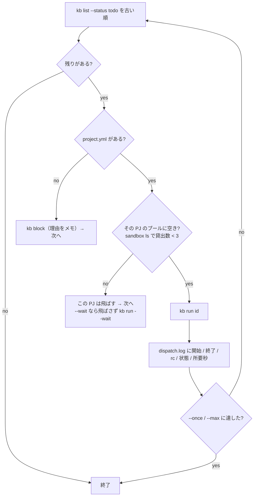

# intake / dispatch（glue）

`glue/bin/intake` は自由な文章をチケットに変換し、`glue/bin/dispatch` は未着手のチケットを順に実行します。どちらも Python 3 で動作します。このページでは、引数、処理の流れ、出力とエラーを説明します。

## intake

```
intake <text-file|-> [--pj P] [--kind K] [--model M] [--attach FILE ...] [--dry-run]
```

| 引数 | 意味 |
|---|---|
| `text-file` | 自由文のファイル。`-` で標準入力 |
| `--pj` / `--kind` | プロジェクトと種別を明示的に指定。LLM の判定より優先 |
| `--model` | 使うモデル。既定は `workflow/kit/routes.env` の `MODEL_judgment` |
| `--attach` | 作成したチケットに添付するファイル（複数可。`--attach a.png b.csv` でも `--attach a.png --attach b.csv` でも）。画像は LLM にも見せる |
| `--dry-run` | チケットを作成せず、判定結果の JSON を出す（添付はしない） |

### 動き

1. 入力の先頭 5 行から `pj:` / `kind:` 行を読み取って指定値として使い、本文からは取り除く
2. `--pj` / `--kind` があればそれを優先。指定値は存在の確認する
3. Mac 上の一時ディレクトリを作業ディレクトリに、ツールなしで `claude -p` を 1 回呼ぶ。渡すのはプロジェクト一覧（`project.yml` の display_name / repo / stack、ないプロジェクトは「project.yml なし」と明記）、種別一覧（ワークフローの YAML の description）、判定の目安、チケットの形、依頼文。`--attach` に画像（png / jpg / gif / webp）があるときだけ、その一時ディレクトリの `attachments/` に画像を複製し、`--tools Read` で呼んで「読み取れた事実だけを本文の `## 現状` に書く」よう指示する（画像が無いときの呼び方は変わらない）
4. 出力の JSON（`pj` / `kind` / `title` / `body` / `confidence` / `reason`）を取り出す。指定済みの pj / kind で上書き
5. 本文末尾に `（intake <日時> / model <モデル> / confidence <値> / <理由>）` を付けて `kb new`。本文冒頭に `pr: N` があれば `--pr` に回す。`--attach` は `kb new --attach` に渡す。**チケットは作れたのに添付だけ失敗した**ときは、id を出してログも書いたうえで終了コード 2 で終わる（`kb attach <id> <ファイル>` でやり直す）
6. `workspace/logs/intake.log` に 1 行（日時 / id / pj / kind / confidence / モデル / 理由）

### 出力

通常は `kb new` の出力として、チケット ID と本文のパスを表示します。`--dry-run` の場合は、判定結果を JSON で表示します。

```json
{
  "pj": "kumitate",
  "kind": "bug",
  "title": "fix: calendar の表題テストを固定日時にして時間依存を解消する",
  "body": "## 背景\n…\n## 完了条件\n- …",
  "confidence": 0.9,
  "reason": "kumitate の apps/web のテストの話。不具合修正なので bug"
}
```

### エラー

| メッセージ | 原因 |
|---|---|
| `入力が空` | ファイルが空 |
| `pj=… は […] のどれでもない` | 指定したプロジェクト / 種別が存在しない |
| `claude -p が失敗` | Claude Code の認証、ネットワーク |
| `JSON が取れない` | LLM が JSON を出さなかった。出力の末尾を表示する |
| `kb new が失敗` | LLM の判定した pj / kind が存在しない等。`kb` のエラーを表示する |

## dispatch

```
dispatch [--pj P] [--once] [--max N] [--dry-run] [--wait [分]] [--resume-paused]
```

| 引数 | 意味 |
|---|---|
| `--pj` | プロジェクトを絞る |
| `--once` | 1 件だけ |
| `--max N` | N 件まで（既定は無制限） |
| `--dry-run` | `kb run --dry-run`。VM を触らず、状態も進まない |
| `--wait [分]` | プールが満杯の PJ を飛ばさず、`kb run --wait <分>` で空くまで待たせる（分。値を省くと 60 分） |
| `--resume-paused` | 鍵の利用枠切れで一時停止中のチケット（`kb resumable`）**だけ**を、解除時刻を過ぎたものから `kb run <id> --from` で続きから回す。他の todo には手を付けない。制御系の `aifactory-resume.timer` が 5 分ごとに呼ぶ（ADR-0043） |

### 動き



- 直列。1 件終わるまで次は始めない
- 判断はしない。種別は kanban が持つ
- プール台数は `POOL_PER_PJ = 3`（`40-pool.sh` で作った台数に合わせる）
- `--dry-run` ではプール確認をしない
- `--wait` でもプール確認をしない。待つのは runner 1 か所（`kb run --wait` → `workflow/bin/run --wait`。ADR-0031）。上限を超えたチケットは `todo` に戻るので、次の `dispatch` が拾い直せる
- 鍵の利用枠切れで一時停止中のチケット（runner が `failure: quota` を残し、kb が `todo` に戻したもの）は、解除時刻（`retry_after`）を過ぎるまで飛ばし、過ぎていれば初めからではなく `kb run <id> --from` で**続き**（記録の退避ブランチと工程）から回す。`--resume-paused` はこの続きだけを対象にする（ADR-0043）

### 出力

標準出力と `workspace/logs/dispatch.log` に、同じ内容を出力します。

```
[dispatch] start 204 kumitate bug fix: calendar の表題テストを…
[kb] …/workflow/bin/run kumitate 204 bug …/tickets/204-….md
[run kumitate/204 …]
[dispatch] end   204 kumitate bug rc=0 status=review 1830s
[dispatch] 205 myapp bug: project.yml 無し → blocked
[dispatch] 206 kumitate: 利用枠切れで一時停止中（2026-09-09T15:00:00+09:00 以降に続きを回す）→ 飛ばす
[dispatch] start 207 kumitate feature 空表示の文言… [続き: implement から origin/sandbox/207-feature-wip・利用枠切れ 1 回目]
[dispatch] todo が無い（または全部飛ばした）。終了
```

## ログ

| ファイル | 形 |
|---|---|
| `workspace/logs/intake.log` | `<日時>\t<id>\t<pj>\t<kind>\t<confidence>\t<model>\t<reason>` |
| `workspace/logs/dispatch.log` | `<日時>\t<メッセージ>` |

どちらも workspace（`$AIFACTORY_WORKSPACE/logs/`）に保存され、このリポジトリでは Git の追跡対象外です。ログには処理結果を記録し、認証情報は出力しません。
