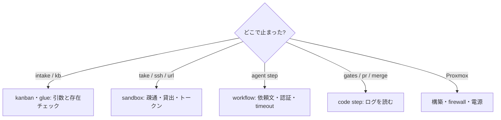

# トラブルシューティング

症状に応じた確認箇所と対処方法をまとめています。まず、どの処理で止まったかを確認し、該当する表を読んでください。

## intake / kb

| 症状 | 原因 | 対処 |
|---|---|---|
| `pj は […] のどれか` | プロジェクト名の誤り、またはプロジェクト定義ディレクトリがない | `ls "$AIFACTORY_WORKSPACE/projects" examples/projects` |
| `kind は […] のどれか` | 種別名の誤り | chore / bug / feature / hotfix / research / merge-pr |
| intake が `JSON が取れない` | LLM が JSON を出さなかった | 出力末尾を読む。入力が短すぎる、または `claude` の認証切れ |
| intake が `claude -p が失敗` | Mac の Claude Code が未認証 | `claude` を一度対話で起動して認証 |
| `kb run` が `project.yml が無い` | そのプロジェクトに定義書がない | [プロジェクトを追加する](guides/add-project.md) の 3 と 4 |
| `kb run` が `done。やり直すなら kb reopen` | 完了済みチケット | `kb reopen <id>` |
| dispatch が全部飛ばす | プールが全部貸出中、または project.yml なし | `sandbox ls`、`kb list --status blocked` |

## sandbox

| 症状 | 見るところ | 対処 |
|---|---|---|
| `take` が「空きなし」 | `sandbox ls` | 貸出中で不要なものを `release`。足りなければプールを増やす |
| `take` が GitHub App のエラー | `sandbox gh-app status` | 未インストールならインストールリンクから。`pj/<pj>.env` の `GH_REPO` を確認 |
| `task-xxx.sb.internal` が解けない | `dig sb-gw.sb.internal`、Tailscale の split DNS | split DNS が消えていないか。`ssh root@10.77.0.2 systemctl status dnsmasq` |
| 10.77.0.2 に ping 不可 | Tailscale 管理コンソールの route 承認。`pct exec 9000 -- journalctl -u tailscaled -n 20` | `Drop: … no rules matched` なら ACL に `10.77.0.0/16` の grant を足す。急ぎなら `~/.config/sandbox/env` に `SB_JUMP=<PVE_HOST と同じ値>` |
| VM に ssh 不可 | `ssh $PVE_HOST qm status 92NN` | `qm start`。起動していれば `qm terminal 92NN` |
| ssh が途中で `Operation timed out` | 別セッションが VM を再起動・作り替えた | `kb reopen` → `kb run`。[複数セッションで作業する](guides/multi-session.md) |
| `reset` / `release` が失敗 | `qm listsnapshot 92NN` に `clean` があるか | なければ `qm destroy` → `40-pool.sh`。rollback のロック競合は CLI が待ってリトライする |
| VM から GitHub に出られない | `ssh $PVE_HOST 'iptables -t nat -S \| grep 10.77'` | SDN 再適用 `pvesh set /cluster/sdn` |
| Mac から VM に届かない（ファイアウォール有効化後） | `qm config <vmid> \| grep firewall`、`/etc/pve/firewall/<vmid>.fw` | `50-firewall.sh` を再実行。`clean` にファイアウォール=1 が含まれている必要がある |
| `sandbox` コマンドが古い動きをする | `diff ~/.local/bin/sandbox sandbox/bin/sandbox` | `sandbox/bin/install.sh` を再実行 |

## エージェントが担当する工程

| 症状 | 見るところ | 対処 |
|---|---|---|
| 認証エラー | `agent-<step>-<n>.log` の末尾、VM 内 `env \| grep CLAUDE_CODE_OAUTH_TOKEN` | `claude setup-token` → `sandbox token set <pj>` → `sandbox reinject <id>` |
| `outputs` がなくて工程失敗 | 同ログの末尾 | エージェントが出力先を見落とした（依頼文の「出力（必須）」）、timeout、途中でツール拒否。`timeout_min` を増やすか、チケットを小さくする |
| 範囲外の変更をした | `work/report.md`、`review.md` | チケットに範囲を明記。base で既に失敗するゲートは `known_red_gates` |
| planner が STOP | `work/plan.md` の先頭 | 依頼が不明確・矛盾・危険。人間への質問に答えてチケットを直す |
| 同じ工程を繰り返して `human` | `state.json` の `loops` | 上限（gates 2 回 / review 1 回）。ログを読んで根本原因を直す |
| 依頼文に古い事実が入っている | `prompt-<step>-<n>.md` の「プロジェクト」節 | `project.yml` の `facts` を直す（次の run から効く） |

## スクリプトが担当する工程

| 症状 | 見るところ | 対処 |
|---|---|---|
| gates が失敗 | `code-gates-<n>.log`、`work/gates.txt`、VM 内 `~/gates/<name>.log` | 変更前のブランチでも失敗しているなら `known_red_gates`。環境依存（GLB なし、macOS 用の基準画像）は情報扱いにする |
| `pr-create.sh` が「コミットがない」 | `code-pr-<n>.log`、`work/report.md` | implementer がコミットしなかった理由が report にあるはず |
| push が 403 | `code-pr-<n>.log` | GitHub App トークンの失効（1 時間）か未インストール。runner はスクリプトの実行前に払い出し直すので、それでも出るなら `sandbox gh-app status` |
| merge が「コンフリクトマーカーが残っている」 | `code-merge-<n>.log` | resolve に戻る。上限を超えたら人間が解消 |
| merge が「base 未取り込み」 | 同 | `origin/<base>` が進んだ。再実行 |

## Proxmox

| 症状 | 見るところ | 対処 |
|---|---|---|
| Proxmox ホストに ssh 不可 | `pvecm nodes`（クラスタなら別ノードから） | 電源投入（WoL / IPMI / 物理ボタン）。プールは onboot=0 なので `qm start` |
| `qm clone` / `snapshot` で "Sum of all thin volume sizes exceeds…" | `lvs pve/data` の `data%` | WARNING で問題なし（thin の仕様）。実使用が増えたらプールを減らす |
| クラスタが quorate でない | `pvecm status` | 他ノードの状態。構築作業はやめて先に直す |
| 構築スクリプトが途中で落ちた | `sandbox/BUILD.md` の完了条件 | 完了条件を 1 つずつ確認し、落ちたステップから再実行（冪等に書いてある） |

## 記録を取る

直したら、原因と対処を残します。

- 一時的な回避 → `workspace/docs/`（自分の環境のメモ）
- 手順の誤り → `sandbox/BUILD.md` / `OPERATIONS.md`
- 設計の変更 → `docs/adr/`
- runner や CLI の罠 → `workflow/README.md` の「踏んだ罠と対処」

同じ問題に遭遇した人が、原因を確認して対処を再現できるよう、確認方法と実行した手順を具体的に残してください。
